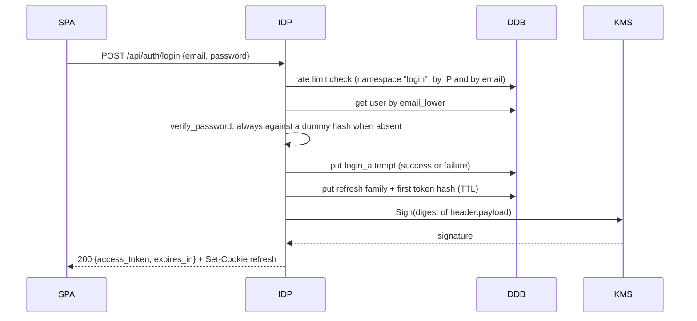
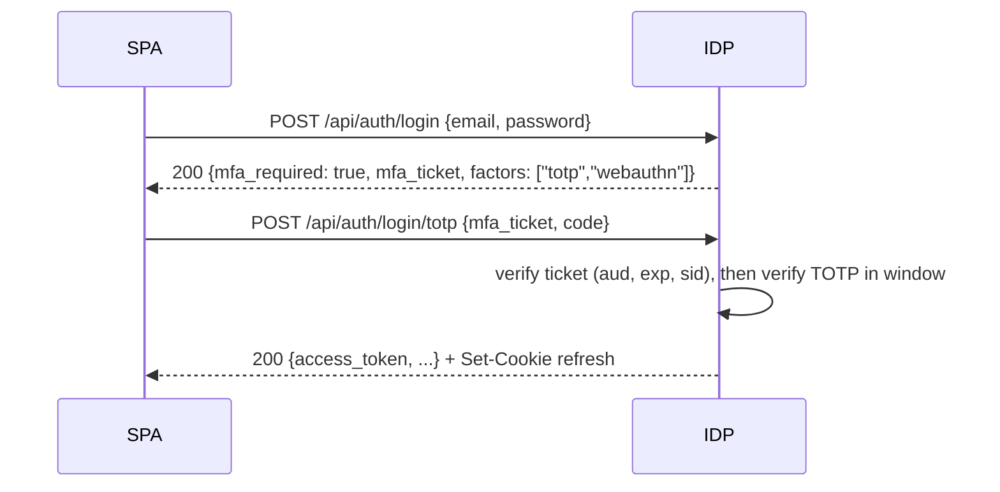
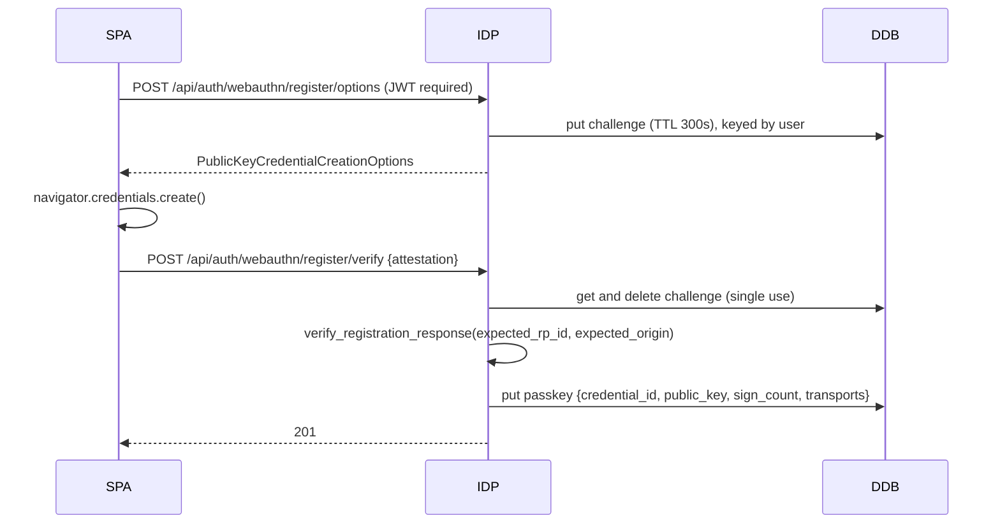
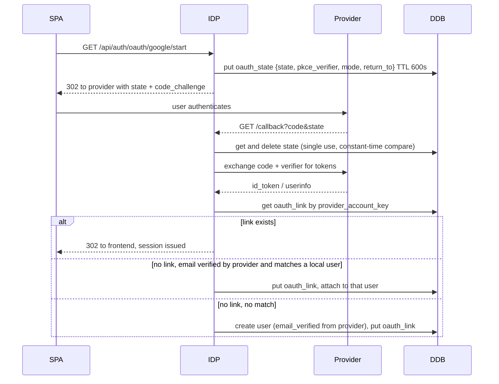
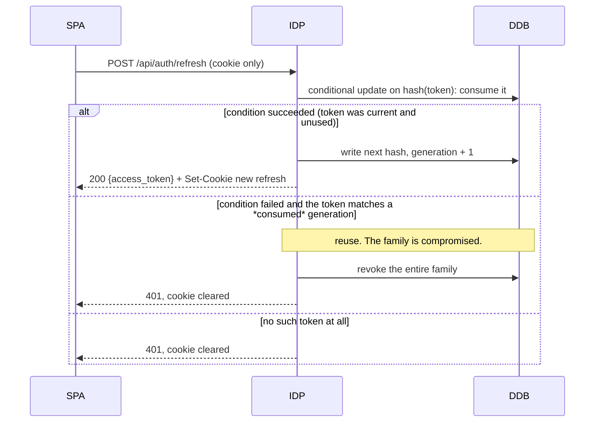

# The WebbPulse unified identity standard

Status: design, not yet implemented. Target package: `webbpulse.identity`, landing across
0.6.0 to 0.11.0.

Every WebbPulse product needs the same twelve things: password login, email verification,
password reset, TOTP, recovery codes, passkeys as a second factor, passkeys as the only
factor, Google sign-in, GitHub sign-in, refresh rotation, logout, and an audit trail. Two
products have built parts of that twice and neither has built all of it. This document
specifies one implementation, in this package, that each product mounts and configures.

It is a design document. Where it states a fact about AWS behaviour it cites the
documentation that fact came from, and where it could not confirm something it says so
rather than guessing. Section 11 lists what genuinely needs a decision.

---

## 1. Goals, non-goals, and the locked decisions

### 1.1 Goals

1. One implementation of every authentication flow, in `webbpulse.identity`, mounted by
   each product rather than copied into it.
2. A product turns capabilities on and off through settings. It does not compose its own
   routes, and it does not subclass a router to change a flow.
3. Access tokens are verified by the API Gateway HTTP API JWT authorizer, before any domain
   Lambda is invoked. A domain function reads claims and never re-verifies a signature.
4. The signing key is a KMS key. No signing secret exists in any environment variable, any
   Secrets Manager value, or any process memory.
5. Adoption invalidates no stored password hash, and carries every existing passkey and
   TOTP enrolment across without re-enrolment.

### 1.2 Non-goals

- **No cross-product single sign-on.** A CarModPicker session is not a Portfolio session.
  The two products share code, not users, not a database, and not a token audience.
- **No central auth server.** There is no shared identity account, no shared hostname, and
  no runtime dependency of one product on another. Each product runs its own copy in its
  own AWS account.
- **No Cognito.** See 1.3.
- **No user migration between products**, and no account linking across them.
- **No OAuth authorization server.** The product is not an OAuth provider for third party
  clients. It consumes Google and GitHub as an identity source and issues tokens only to
  its own first party frontend.
- **No SCIM, no directory sync, no enterprise SSO.** Neither product has a tenant that
  wants them.

### 1.3 The locked decisions, restated

These were settled before this document and are not reopened here. They are restated
because the rest of the design only makes sense against them.

- **App-managed identity, not Cognito.** One shared FastAPI application, `webbpulse.identity`,
  carrying routers, services, storage adapters, email templates and config. Each product's
  composition root mounts it into that product's own `identity` domain Lambda, an OCI image
  on arm64 behind the Lambda Web Adapter, in that product's own AWS account. Products
  configure it; they do not compose it.
- **Mandatory baseline in every product.** Password login with bcrypt via
  `webbpulse.security`, email verification and password reset over SES with signed
  single-use links rate limited through `webbpulse.ratelimit`, TOTP with recovery codes,
  passkeys via py_webauthn both passwordless and as a second factor, and OAuth sign-in with
  Google and GitHub linked to a local account.
- **Asymmetric tokens signed by KMS**, with JWKS and OIDC discovery served by the identity
  function, rotation by `kid` with overlap, so the HTTP API JWT authorizer verifies access
  tokens before any domain Lambda runs.
- **Sessions.** A short-lived access token held in memory by the SPA and never in
  localStorage, plus an httpOnly Secure SameSite refresh cookie with rotation and reuse
  detection, refresh tokens stored hashed in DynamoDB with a TTL, and logout revoking the
  whole family.
- **Storage in DynamoDB** through `webbpulse.dynamodb.Repository`, observability through
  `webbpulse.otel` and `webbpulse.logging`, errors through `webbpulse.http`.

### 1.4 What this reverses, deliberately

The package README currently says, under "Not shared, deliberately":

> What stays per-app is the **policy** above those primitives, and it is most of the file in
> each case: [...] and every OAuth, WebAuthn and TOTP flow.

This document reverses that for the flows and keeps it for the identity model. The 0.5.0
reasoning was that policy differs per product, and for the *user model* it genuinely does:
CarModPicker has ordinary users with `disabled` and `email_verified`, Portfolio has exactly
one administrator. But a WebAuthn ceremony does not differ per product. Neither does a
refresh rotation, a TOTP window, or a single-use reset link. Those are the parts each
product currently gets subtly wrong in its own way, and they are the parts where being
wrong is a vulnerability rather than an inconvenience.

So the split moves up one level. `webbpulse.identity` owns the **flows**. The product owns
**who the user is and what they may do**, supplied through a small interface (7.3) rather
than by forking a router. The README's "not shared" section should be rewritten when 0.6.0
lands; it will otherwise contradict the package's own largest module.

---

## 2. Architecture

### 2.1 Components

```
webbpulse.identity/
  app.py            build_identity_app(settings, hooks) -> FastAPI
  settings.py       IdentitySettings, the whole configuration surface
  routers/
    password.py     register, login, change password
    verification.py email verification send and confirm
    reset.py        password reset request and confirm
    totp.py         enrol, activate, verify, disable
    recovery.py     recovery code generation and consumption
    webauthn.py     registration and authentication ceremonies
    oauth.py        provider start, callback, link, unlink
    session.py      refresh, logout, logout-all
    discovery.py    /.well-known/openid-configuration, /.well-known/jwks.json
  services/         the flow logic, no FastAPI imports
    tokens.py       KMS signing, claim assembly, JWKS assembly
    sessions.py     refresh families, rotation, reuse detection
    passwords.py    policy, hashing via webbpulse.security
    mfa.py          TOTP, recovery codes
    passkeys.py     py_webauthn wrapper, challenge lifecycle
    oauth.py        provider metadata, state, PKCE, linking
    mail.py         SES send, templates
    audit.py        the event writer
  storage/          Repository subclasses, one per entity
  templates/        email bodies, branded from settings
  hooks.py          IdentityHooks, the product's own user policy
```

Three rules hold the shape together:

- **`services/` imports no FastAPI.** Every flow is callable from a test, a CLI, or a
  future queue consumer without a request object. The routers are thin: parse, call a
  service, render.
- **`storage/` subclasses `webbpulse.dynamodb.Repository`** and speaks DynamoDB's own
  vocabulary, as that class intends. No ORM appears here.
- **Nothing calls AWS at import.** The package already holds this line
  (`src/webbpulse/__init__.py:3`), and the identity module keeps it: KMS, SES and DynamoDB
  clients are all built on first use, so a cold start costs no network round trip.

### 2.2 Where it runs

Each product already has, or is heading toward, a per-domain function layout. CarModPicker's
is specified in `docs/migration/split-plan.md` (that repo), which gives `identity` 24 routes
under the single prefix `/api/auth`, served by one function whose route keys are
`/api/auth` and `/api/auth/{proxy+}` (split-plan section 3.5). The identity app mounts
there. Nothing about this design adds a function or a prefix to that plan.

The composition root is the descriptor the split plan already defines, with
`load_routers` as a callable so mounting one domain does not import the other eight:

```python
# backend/app/composition/domains.py, CarModPicker
IDENTITY = Domain(
    name="identity",
    title="CarModPicker identity",
    load_routers=lambda: [build_identity_router(identity_settings(), CarModPickerHooks())],
    router_prefix="/api",
    requires_secrets=("google_client_secret", "github_client_secret"),
)
```

### 2.3 Public routes, authorized routes, and the authorizer

The identity function is the one function on the API whose routes are mostly **public**,
because they are how a caller becomes authenticated in the first place. That inverts the
usual arrangement and is the single most important thing to get right in the Terraform.

| Route | Authorizer | Why |
|---|---|---|
| `POST /api/auth/register` | none | no token exists yet |
| `POST /api/auth/login` | none | issues the first token |
| `POST /api/auth/login/totp` | none | second leg of login, holds a short-lived MFA ticket, not an access token |
| `POST /api/auth/login/webauthn/*` | none | passwordless login |
| `POST /api/auth/refresh` | none | the access token is expired by definition; the refresh cookie authenticates it |
| `POST /api/auth/logout` | none | must work with an expired access token |
| `GET /api/auth/verify-email/{token}` | none | the link is the credential |
| `POST /api/auth/reset/*` | none | the link is the credential |
| `GET /api/auth/oauth/{provider}/start` | none | pre-login |
| `GET /api/auth/oauth/{provider}/callback` | none | pre-login |
| `GET /.well-known/openid-configuration` | none | the authorizer itself fetches this |
| `GET /.well-known/jwks.json` | none | the authorizer itself fetches this |
| `POST /api/auth/totp/enrol`, `activate`, `disable` | **JWT** | changing your own credentials |
| `POST /api/auth/webauthn/register/*` | **JWT** | adding a credential to a known account |
| `POST /api/auth/recovery-codes` | **JWT** | regenerating codes |
| `POST /api/auth/oauth/{provider}/link`, `unlink` | **JWT** | attaching to a known account |
| `POST /api/auth/password` | **JWT** | change password while signed in |
| `GET /api/auth/sessions`, `DELETE /api/auth/sessions/{sid}` | **JWT** | session management |

**The two discovery routes must be reachable without authentication and without the
staging access gate.** The authorizer fetches them itself, from outside any browser
session, and it holds no cookies. If the gate's REQUEST authorizer covers them, the JWT
authorizer cannot fetch the JWKS and every authorized route fails closed. See 2.5.

Because an HTTP API attaches at most one authorizer per route, the public and authorized
halves of `/api/auth` cannot both live under a single `ANY /api/auth/{proxy+}` route key
with an authorizer on it. Two options, and the second is recommended:

1. Enumerate route keys, giving each authorized path its own key with the JWT authorizer
   and leaving the greedy key unauthorized. Precise, but it grows the Terraform by roughly
   a dozen route keys and every new identity route needs one.
2. **Leave the whole `/api/auth` prefix unauthorized at the gateway and have the identity
   app verify its own bearer tokens** for the authorized subset, using
   `webbpulse.security.bearer_claims` with the JWKS public key. The identity function is
   the token issuer, so it can verify locally with no extra dependency, and it is the one
   function where in-app verification costs nothing architecturally.

Recommendation: option 2 for `/api/auth`, and the JWT authorizer for **every other
domain**, which is where the benefit actually is. The point of the authorizer is that
`catalog`, `build-lists`, `users` and the rest never run a line of Python for an
unauthenticated request. Identity is the exception that issues the credential, so it is
also the exception that checks it in-process.

Note a route-key constraint recorded elsewhere in this estate: an API Gateway route key
cannot end in a slash, and the failure is an apply-time `BadRequestException` while the
plan is green. Write `/api/auth`, never `/api/auth/`.

### 2.4 How a domain Lambda reads claims

It does not verify anything. The authorizer has already rejected every request that reaches
the function, so the claims are trustworthy input.

The Lambda Web Adapter forwards the API Gateway request context as a JSON string in the
`x-amzn-request-context` header. The package already names that header and parses it for
the source IP (`src/webbpulse/http.py:53`, and `client_ip` at `src/webbpulse/http.py:85`),
so the mechanism is proven in this codebase rather than assumed. Claims land at
`requestContext.authorizer.jwt.claims`, which the API Gateway documentation confirms:

> After validating the JWT, API Gateway passes the claims in the token to the API route's
> integration. Backend resources, such as Lambda functions, can access the JWT claims.

M0 observed that directly rather than taking the documentation's word for it: the request
context carried exactly one authorizer key, `jwt`, with the claims beneath it, and 9.1 has
the full body. It also turned up something the documentation does not say, which is that
every claim value arrives as a string, `exp` and `iat` included. `authorizer_claims()` has
to coerce the numeric claims rather than pass them through.

`webbpulse.identity` therefore ships a dependency in the **http** module's spirit, not a
new envelope:

```python
from webbpulse.identity import authorizer_claims

Principal = Annotated[dict, Depends(authorizer_claims())]


@router.get("/api/build-lists")
async def list_build_lists(principal: Principal, repos: Repositories = Depends(...)):
    return repos.build_lists.for_user(principal["sub"])
```

`authorizer_claims()` reads the header, parses the JSON, and returns the claims mapping.
It raises 401 in the package's existing envelope when the section is absent, which in
production means a misconfigured route rather than a real anonymous caller, and that is
worth failing loudly on.

**A deliberate local-development seam.** There is no API Gateway locally, so no header. The
dependency accepts `local_fallback=True`, which falls back to verifying the bearer token
in-process against the JWKS. That keeps `mount_all` (the local all-domains root at
`src/webbpulse/http.py:812`) working without a second wiring, which is the same argument
that function already makes for itself. The fallback is refused when `environment` is
`production`, so a missing authorizer can never silently degrade into in-app verification
in a deployed environment.

**The claims are forwarded, and M0's 401 was our own parsing bug.** The paragraph above
says the mechanism is proven in this codebase because the package already parses the header
for the source IP. That is exactly right, and it is worth recording how nearly the opposite
conclusion got written down instead.

On 2026-09-09 a token the authorizer had already accepted, on a route that had already
invoked the function, still produced a 401 from the handler. The obvious reading was that
the Lambda Web Adapter had not forwarded `x-amzn-request-context` and that the image needed
extra configuration. That reading was wrong. The adapter forwards the request context by
default and no `AWS_LWA_*` variable governs it. What differed was the decoding:
`webbpulse.http.client_ip` parses the header value as **plain JSON**, matching the adapter's
own documentation ("forwarded in the `x-amzn-request-context` header as a JSON string"),
while the spike's `spike.py` base64-decoded it first. Base64-decoding a plain JSON string
raises, `spike.py` caught the error and returned an empty mapping, and the empty mapping
became a 401 indistinguishable from a rejected token.

The lesson is not about the adapter. It is that **a decoding assumption that fails closed
into "unauthenticated" is indistinguishable from a real authorization failure**, and that is
what turned a one-line bug into an afternoon of suspecting the gateway, the image and the
key. Three requirements come out of it, and all belong to M1 rather than to a product:

- **One parser for this header, in the package.** Two independent readings of
  `x-amzn-request-context` already exist, `webbpulse.http.client_ip` and `spike.py`, and they
  disagreed about the encoding. `authorizer_claims()` must be the only implementation, and it
  must parse plain JSON, since that is what the adapter actually sends and what the package's
  own working code has always assumed.
- **`authorizer_claims()` must distinguish "no header" from "unparseable header" from "no
  claims".** A missing header is a deployment fault, a header that will not parse is a bug in
  our own code, and a present header with no `authorizer.jwt.claims` section is a routing
  fault. None of the three is an anonymous caller, and all three should raise with a message
  naming which one it was.
- **Never swallow a decode error into an empty mapping.** `spike.py` caught
  `binascii.Error`, `ValueError` and `UnicodeDecodeError` and returned `{}` on all of them,
  which is what made a parsing bug present as an authorization outcome. Failing loudly here
  costs nothing, because a handler behind the authorizer has no legitimate path on which the
  header is absent or malformed.

### 2.5 The staging access gate interaction, and why it is a blocker

CarModPicker's staging API already attaches a REQUEST authorizer to every route for the
staging access gate (`terraform/apigateway.tf:38` in that repo, `authorizer_id =
local.staging_gate_enabled ? module.staging_access_gate[0].http_api_authorizer_id : null`),
and the surrounding comment says it "runs on every route". Portfolio has the same
arrangement.

An HTTP API route takes one authorizer. So on a gated staging environment the JWT
authorizer and the gate authorizer **cannot both be attached to the same route**. This is a
genuine blocker for testing the authorizer path in staging, and it has three possible
answers:

1. Fold the gate check into the JWT authorizer's job by moving the gate to CloudFront
   rather than API Gateway. Cleanest, largest change, and out of scope here.
2. Replace the gate's REQUEST authorizer on staging with a Lambda authorizer that checks
   the gate cookies **and** verifies the JWT, returning the claims in its context. A
   REQUEST authorizer can return a context mapping, so domain functions would read
   `requestContext.authorizer.lambda.<key>` instead of `.jwt.claims`. That is a different
   claim path, and `authorizer_claims()` would need to read both.
3. Only enable the JWT authorizer where the gate is off (production, and staging with the
   gate disabled), and accept that gated staging verifies in-app.

This needs a decision and is question Q3 in section 11. It does not block the identity
application itself, only the gateway wiring, and the two can be delivered in either order.

**One constraint M0 added, which none of the three answers removes.** The discovery route
must be exempt from the gate, and not merely for the convenience of a verification fetch at
request time. 3.4 records that API Gateway fetches
`<issuer>/.well-known/openid-configuration` when the authorizer is **created**, from its own
infrastructure, carrying no gate cookie and no origin-verify header. A discovery route
behind the gate returns the gate's 401 to that fetch, and `CreateAuthorizer` then fails
outright with the same `BadRequestException` as a route that does not exist. So on a gated
staging environment the two `.well-known` routes carry `authorization_type = "NONE"` under
every option above. That is a hole in the gate in the literal sense and an empty one: what
sits behind those paths is a public key and a document saying where the public key is, which
is what every OIDC provider on the internet serves anonymously by definition. The private
half never leaves KMS. Option 3 in particular is not an escape from this, since the point of
the option is to enable the JWT authorizer somewhere, and wherever it is enabled the create
call fetches.

### 2.6 Request flows

Notation: **SPA** is the browser app, **IDP** is the identity function, **KMS** is
`kms:Sign`, **DDB** is DynamoDB.

#### Password login, no MFA



The access token is in the JSON body, never in a cookie: the SPA holds it in memory (7.1).
The refresh token is in the cookie, never in the body: JavaScript must not be able to read
it.

#### Password login, MFA required

The first leg returns **no access token**. It returns an MFA ticket, which is a separate
short-lived signed token with `aud` of `<issuer>/mfa` and a `sid` binding it to the pending
session, and a list of the factors that account can satisfy.



The ticket is not an access token and is rejected by every other audience, so a stolen
ticket buys nothing but a second factor prompt. It is single use: its `jti` is recorded and
a replay is refused.

Step-up for a sensitive action inside a session works the same way, except the first leg is
the existing access token: the SPA calls the sensitive route, gets 403 with
`error_code: MFA_REQUIRED`, satisfies a factor, and receives a new access token whose `amr`
now includes it. Sensitive routes assert on `amr`, not on a boolean.

#### Passkey registration



#### Passkey login, passwordless

Same shape, with `generate_authentication_options` and an **empty** `allowCredentials` so
the authenticator offers its discoverable credentials. Verification looks the credential up
by `credential_id`, checks the signature against the stored public key, and then checks the
signature counter: if the stored counter is non-zero and the new one is not greater, the
credential may have been cloned. The design records the anomaly, refuses the login, and
raises an audit event. Some authenticators legitimately always report zero, which is why
the check is conditional on the stored value being non-zero.

A passwordless passkey login yields `amr: ["webauthn"]` and, because a passkey with user
verification is two factors in one gesture, satisfies an MFA requirement on its own when
the authenticator reported UV. When it did not, it counts as one factor and a second is
still demanded.

#### OAuth link and login



**The email-match branch is the dangerous one.** Attaching a provider identity to an
existing local account on email alone is account takeover if the provider does not verify
the address. So: the link is only made automatically when the provider asserts the email is
verified (`email_verified` for Google, a verified primary address from the GitHub emails
endpoint), and otherwise the flow stops and asks the user to sign in locally first and link
from their settings page. Q1 in section 11 asks whether even the verified case should be
automatic.

`mode` in the state distinguishes a login from a link performed by an already-authenticated
user, so a callback cannot be replayed into the other meaning.

#### Refresh rotation with reuse detection

This is the flow that most repays care, so it is specified exactly.

A **family** is one login. It has a `family_id`, a user, a device fingerprint, and a
generation counter. Each refresh token is a random 256-bit value; only its SHA-256 hash is
stored. Rotation replaces the stored hash and increments the generation.



The consume is a single `UpdateItem` with a `ConditionExpression`, which
`webbpulse.dynamodb.Repository.update` already supports along with `ReturnValues`
(`src/webbpulse/dynamodb.py:316`). That matters: the check and the consume must be one
atomic operation, or two concurrent refreshes race and both succeed, which is exactly the
condition reuse detection exists to notice.

**Concurrent refresh is a real, benign case**, and a naive implementation punishes it: two
tabs both refresh, the second sees a consumed token, and the user is logged out of a
correct session. The design allows a short **grace window**: a consumed token replayed
within 10 seconds returns the *same* successor that the first call minted, rather than
revoking. Beyond that window a replay is treated as theft. The successor is stored on the
consumed record for exactly this purpose, and the grace is a setting so a product can set
it to zero and take the stricter behaviour.

#### Logout

`POST /api/auth/logout` revokes the whole family, not the single token, and clears the
cookie. Revoking one token would leave a stolen sibling live. `POST /api/auth/logout-all`
revokes every family for the user, which is what a "sign out everywhere" button and a
password change both call.

Because access tokens are verified by the gateway against a public key, **a logout cannot
invalidate an already-issued access token**. That is inherent to stateless verification and
is why access token lifetime is short (3.2). Anything that must revoke instantly, such as
disabling an account, has to be enforced by the domain that owns the resource, not by the
token. This is stated plainly here because it is the standard surprise of this design.

#### Email verification and password reset

Both are the same primitive: a single-use, time-limited, signed link.

The token is 256 bits of randomness. **Only its hash is stored**, so a database read cannot
be turned into a working link. The email carries the raw value. Verification hashes the
presented value and looks it up, checks the TTL in code as well as relying on the DynamoDB
TTL (the package's own `ttl_in` docstring at `src/webbpulse/dynamodb.py:76` warns that TTL
deletion is a storage reclaim mechanism on DynamoDB's own schedule, "typically within a
couple of days", and never an access control), and deletes it on use.

Password reset additionally revokes every refresh family for that user on success, because
a reset is the remedy for a compromise and leaving old sessions alive defeats it.

Both request endpoints answer **identically whether or not the address exists** (5.4), and
both are rate limited per address and per IP.

---

## 3. Token design

### 3.1 The algorithm, decided by the authorizer

The locked decision says ES256 preferred, RS256 acceptable, justify the pick, and verify
what the authorizer supports.

**It must be RS256.** The API Gateway documentation for HTTP API JWT authorizers states, in
the token validation workflow:

> Check the token's algorithm and signature by using the public key that is fetched from the
> issuer's `jwks_uri`. **Currently, only RSA-based algorithms are supported.** API Gateway
> can cache the public key for two hours. As a best practice, when you rotate keys, allow a
> grace period during which both the old and new keys are valid.

ES256 is an ECDSA algorithm, so it is excluded. The preference for ES256 (smaller keys,
smaller signatures, cheaper signing) cannot be exercised while the built-in JWT authorizer
is doing the verification. Choosing ES256 anyway would mean writing a Lambda authorizer to
verify it, which reintroduces a Lambda invocation on every request and gives up the entire
benefit of the built-in authorizer.

So: **RS256**, KMS key spec **RSA_2048**, signing algorithm **`RSASSA_PKCS1_V1_5_SHA_256`**.

Two details worth stating, because both are easy to get wrong:

- **PKCS1 v1.5, not PSS.** The KMS documentation says "When signing with RSA key pairs,
  RSASSA-PSS algorithms are preferred. We include RSASSA-PKCS1-v1\_5 algorithms for
  compatibility with existing applications." That general preference does not apply here:
  JWA defines `RS256` as RSASSA-PKCS1-v1_5 with SHA-256, and `PS256` as the PSS variant. The
  authorizer verifies what the JWKS `alg` says, and RS256 is the interoperable choice.
  Signing with PSS and labelling it RS256 produces a token nothing can verify.
- **RSA_2048, not larger.** A 4096-bit key produces a larger signature and a slower, more
  expensive `kms:Sign` on the hot path of every login and every refresh. 2048 is the
  standard for JWT signing and is what every OIDC provider in wide use serves.

### 3.2 Claims and lifetimes

Access token:

| Claim | Value | Note |
|---|---|---|
| `iss` | `https://api.<domain>/api/auth` | must exactly match the authorizer's configured issuer |
| `sub` | the user's `id` | see 3.3 |
| `aud` | `<product>-api`, e.g. `carmodpicker-api` | matched by the authorizer |
| `exp` | `iat` + 10 minutes | |
| `iat`, `nbf` | issue time | the authorizer checks both |
| `jti` | random | for audit correlation, not for revocation |
| `sid` | the refresh family id | ties an access token to its session |
| `typ` | `access` | **mandatory.** Asserted positively by every verifier |
| `amr` | e.g. `["pwd","otp"]` | RFC 8176 values: `pwd`, `otp`, `hwk`, `mfa`, `swk` |
| `roles` | e.g. `["admin"]` | supplied by the product's hooks, never invented here |
| `scope` | space-delimited string | present so a route can use `authorizationScopes` |
| `email`, `email_verified` | convenience | so common a lookup is otherwise made on every request |

**Every token this service issues carries `typ`, and every verifier asserts the value it
expects.** A missing `typ` is a rejection, never a default. This matters because one signing
key covers several token purposes: access tokens, MFA tickets, verification links and reset
links. Without a positive assertion, a token minted for one purpose can be presented for
another, and the failure is silent. CarModPicker has exactly this shape today (8.1). Access
tokens are separated a second time by `aud`, so the authorizer rejects a non-access token
even before the application sees it.

`exp` is **10 minutes**. Short enough that a leaked token is a narrow window and that logout
being non-revoking is tolerable, long enough that refresh traffic is not a load problem.

Refresh cookie lifetime is **30 days** rolling, reset on each rotation, with an absolute cap
of **90 days** after which a full login is required regardless of activity. The absolute cap
is what stops an attacker who has a working family from holding it forever.

The MFA ticket is **5 minutes**, `aud` `<issuer>/mfa`, single use.

Email verification links last **24 hours**; password reset links **1 hour**. Reset is
shorter because it is the higher-value target.

### 3.3 What `sub` is, and why it changes for Portfolio

`sub` is the user's immutable `id`, not the username and not the email.

This differs from what both products do today. CarModPicker's and Portfolio's tokens put the
**username** in `sub` (Portfolio's `verify_token` returns `payload.get("sub")` and
`get_current_user` then calls `users.find_by_unique("username", username)`,
`WebbPulse-Portfolio/backend/app/core/security.py:39-56`). A username is mutable, so a
rename silently invalidates every live token, and worse, a reused username inherits the old
one's sessions. The `id` is stable, which is the entire property `sub` is supposed to have.

The cost is that every consumer reading `claims["sub"]` as a username must change. Section 8
covers that per product.

### 3.4 JWKS and discovery

`GET /.well-known/jwks.json` returns, per RFC 7517, a `keys` array. Each RSA verification
key is:

```json
{
  "kty": "RSA",
  "use": "sig",
  "alg": "RS256",
  "kid": "<see 3.5>",
  "n": "<base64url of the modulus, big-endian, unpadded>",
  "e": "AQAB"
}
```

`n` and `e` come from `kms:GetPublicKey`, which returns a DER-encoded SubjectPublicKeyInfo;
the identity service parses it once and caches the JWK in module state for the life of the
execution environment. This is a read of a public key, so caching it is safe.

`GET /.well-known/openid-configuration` returns the five members OIDC Discovery requires
(`issuer`, plus `jwks_uri`, `response_types_supported`, `subject_types_supported`,
`id_token_signing_alg_values_supported`), with `issuer` byte-identical to the `iss` claim
and to the authorizer's configured issuer. A trailing-slash mismatch here is the classic
failure and presents as every request being denied with no useful message.

**Confirmed by M0.** API Gateway appends `/.well-known/openid-configuration` to the
configured issuer. It does not require the issuer to serve the document at its root, and it
does not go straight to a JWKS.

It is stricter than that, in a way nothing in the documentation prepares you for: **the
fetch happens at `CreateAuthorizer` time, not only when a request is verified.** The
authorizer cannot be created at all unless the URL already answers with a valid discovery
document. The M0 spike's first apply is where this surfaced, as a create-time failure with
the URL quoted back:

```
BadRequestException: Caught exception when connecting to
https://api.staging.webbpulse.com/.well-known/openid-configuration for issuer
https://api.staging.webbpulse.com. Please try again later.
Error: Invalid issuer: https://api.staging.webbpulse.com. Issuer must have a valid
discovery endpoint ended with '/.well-known/openid-configuration'
```

The configured issuer was `https://api.staging.webbpulse.com`, with no path. API Gateway
constructed the discovery URL from it, and named that URL in the error. That is the
resolution path settled.

**The JWKS fetch, also confirmed by M0, and also at `CreateAuthorizer` time.** API Gateway
does read `jwks_uri` out of the discovery document and fetch the JWKS from it, and it does
so during the same create call rather than waiting for a request to verify. The API access
log for the successful apply (`run-84hxuWZUsZ76nhme`, `CreateAuthorizer` at
2026-09-09T05:51:41Z) has both fetches, from AWS-owned source addresses, in the seconds
either side of it:

```
05:51:35Z  /.well-known/openid-configuration  200  44.220.161.215  (AWS us-east-1)
05:51:40Z  /.well-known/openid-configuration  200  184.32.188.63   (AWS us-west-2)
05:51:40Z  /.well-known/jwks.json             200  184.32.188.63   (AWS us-west-2)
```

Two things in that trace are worth keeping. The **discovery document is fetched twice, from
two different AWS regions**, once about six seconds before the create call and once one
second before it. The earlier us-east-1 fetch has a 4402 ms integration latency, which is a
cold start, so it is the validator warming the path; the us-west-2 pair is the fetch that
the authorizer is actually built from. And the **JWKS request comes from the same address as
the second discovery request, in the same second**, which is what following `jwks_uri` out of
a just-retrieved document looks like. Nothing fetched the JWKS at a guessed path, and
nothing fetched it before the discovery document.

The operational consequence is one notch stronger than 10.1 stated. It is not only the
discovery route that has to answer anonymously before the authorizer can be created: **the
`jwks_uri` the discovery document advertises has to answer anonymously at create time too.**
A discovery document that points at a JWKS behind the staging access gate would fail the
create call as surely as a missing discovery route does, and the error would name only the
discovery URL. Both `.well-known` routes carry `authorization_type = "NONE"` in
`terraform/identity_spike.tf` for exactly this reason, and 9.2's `identity` module must keep
both exempt rather than only the discovery one.

**The key cache is not two hours in practice, and the documents are refetched per host.**
The first verification against this authorizer happened at 06:39:33Z, 48 minutes after the
create-time fetches above. Both documents were fetched again, and not once:

```
06:39:33Z  /.well-known/openid-configuration  200  44.234.30.83  (AWS us-west-2)
06:39:33Z  /.well-known/jwks.json             200  44.234.30.83  (AWS us-west-2)
06:39:34Z  /.well-known/openid-configuration  200  44.234.30.73  (AWS us-west-2)
06:39:34Z  /.well-known/jwks.json             200  44.234.30.73  (AWS us-west-2)
06:40:18Z  /.well-known/openid-configuration  200  44.234.28.67  (AWS us-west-2)
```

Three distinct source addresses in 45 seconds, each fetching the discovery document before
the JWKS, and none of them reusing what a create-time fetch 48 minutes earlier had already
retrieved. The plain reading is that the cache is **per authorizer host rather than per
authorizer**, so "cached for two hours" is a per-host ceiling and a request landing on a
host that has not seen the key yet pays a fresh discovery-plus-JWKS round trip.

A second run later the same day behaved identically: every request to the protected route
was accompanied by its own discovery-then-`jwks.json` pair from a distinct AWS address, over
a span far longer than any plausible cache window. So this is the steady-state behaviour
rather than a warm-up effect.

Two things follow, and only one of them is a caution. The caution: **the discovery and JWKS
routes are on the hot path, not just the deployment path.** They are served by the identity
Lambda, so a cold start there adds latency to somebody's first authorized request, and an
outage of that function breaks verification for tokens that were already validly issued.
Serving both documents cheaply matters, which is what 3.4's module-state caching of the
parsed JWK is for. The non-caution: this makes rotation **safer** than the two-hour figure
suggests, not riskier, since a new `kid` propagates faster than the ceiling implies. The
three-hour wait in 3.5 stays anyway, for the reason given there.

Serving discovery at the API root as well as at `<issuer>/.well-known/openid-configuration`
is therefore no longer load-bearing. It is harmless and can stay, but the path is known and
the design need not hedge on it.

**The operational consequence, which is the part that changes deployments.** Because the
fetch is synchronous with `CreateAuthorizer`, the discovery route and the service serving it
are prerequisites of the authorizer rather than peers of it. Concretely:

- The `.well-known` routes must be created, deployed and reachable **anonymously** before
  the authorizer is created. Anonymously matters twice over: API Gateway's validator carries
  no cookie and no origin-verify header, so a discovery route behind a staging access gate
  fails the create call exactly as a missing one does.
- The service serving them must already be running with the configuration that makes it
  serve them. An environment variable that switches discovery on takes effect only after the
  function's update completes and a new execution environment starts.
- **A fresh environment cannot create the authorizer in the same apply that first deploys
  the identity function, unless the ordering is enforced explicitly.** Nothing in the
  authorizer's own arguments implies either dependency: its `api_id` is the API, which
  exists long before any route on it, and it references the serving function not at all. A
  Terraform graph left to its own devices is free to create the authorizer first, and will.

So the Terraform for this needs explicit ordering, in two directions at once. The discovery
routes and the function come **before** the authorizer, by `depends_on`. Any route that
names the authorizer comes **after** it, which happens naturally by reference. The trap is
putting both kinds of route in one `for_each` over a routes map: a single protected route
referencing the authorizer makes the whole map wait on it, including the discovery routes
the authorizer is waiting for, and the apply fails with every route skipped. The protected
route has to be declared separately from the discovery routes for the ordering to be
expressible at all. `terraform/identity_spike.tf` in WebbPulse-Portfolio carries the working
shape, and 9.2's `identity` module should adopt it rather than rediscover it.

One further wrinkle worth writing down: `depends_on` orders the API calls, not their
effects. An auto-deploy stage deploys a new route asynchronously, and
`UpdateFunctionConfiguration` returns while the update is still in progress, so the
authorizer can be created after a successful `CreateRoute` and still fetch a 404. A poll of
the live discovery URL between the two is the reliable form, and the identity module should
provide it rather than leave each consumer to find out.

### 3.5 How `kid` is chosen, and rotation

`kid` is the **base64url of the SHA-256 of the DER SubjectPublicKeyInfo** returned by
`kms:GetPublicKey`. That makes it a deterministic function of the key material itself, so
it is stable across redeploys, identical in every process, and cannot collide between two
different keys. It is deliberately not the KMS key id or its ARN: those are account
identifiers and put an AWS account number in a public document, and they do not change when
the key material does.

Rotation is by adding a key, not by mutating one. KMS automatic key rotation is **not** used
for the signing key, because rotating the material behind a single key id changes what
`GetPublicKey` returns while the `kid` derivation follows it, and old tokens then reference
a `kid` no longer served. Explicit two-key rotation is clearer:

1. Create `identity-signing-<n+1>`. Both keys exist; `IDENTITY_SIGNING_KEY_ARNS` lists both,
   the first being the active signer.
2. Deploy. JWKS now serves **both** JWKs. Nothing signs with the new key yet.
3. Wait for the caches to turn over. API Gateway "can cache the public key for two hours",
   so wait comfortably longer than that; **three hours** is the documented procedure. Keep
   the three hours even though M0 observed refetching far more often than the cache ceiling
   implies (3.4): the two-hour figure is a documented maximum, and a rotation has to be safe
   for the slowest cache in the fleet, not the fastest one seen in one trace.
4. Promote the new key to active signer and deploy. Tokens now carry the new `kid`, and the
   old key is still served so tokens issued in the last 10 minutes still verify.
5. After one full access-token lifetime plus margin (an hour is ample), drop the old key
   from the list and deploy. Schedule the KMS key for deletion no sooner than 30 days later.

Steps 2 and 4 are separate deploys on purpose. Serving a `kid` that nothing has signed with
yet is harmless; signing with a `kid` that is not yet in every cache is an outage. The AWS
guidance is explicit that a rotation should "allow a grace period during which both the old
and new keys are valid", and this procedure is that grace period made concrete.

### 3.6 Signing mechanics

`kms:Sign` accepts a `Message` of 0 to 4096 bytes. A JWT's signing input is
`base64url(header) + "." + base64url(payload)`, which is comfortably under that for these
claims, but the design signs with **`MessageType: DIGEST`** anyway: the service computes the
SHA-256 of the signing input and sends the 32-byte digest. That removes the size limit as a
consideration permanently, keeps the request small, and is exactly what the API documents
for pre-hashed input. The `SigningAlgorithm` is still `RSASSA_PKCS1_V1_5_SHA_256`; KMS skips
only the hashing step, not the padding.

The returned signature for RSA is "defined by PKCS #1 in RFC 8017", which is the raw
signature octet string that JWS wants, so it is base64url-encoded as-is. (Had ES256 been
usable, this would have needed care: KMS returns ECDSA signatures DER-encoded, while JWS
requires the fixed-width r||s concatenation. Another small reason the forced choice is not
a loss.)

**Latency and cost.** One `kms:Sign` per issued access token, so one per login and one per
refresh, at roughly 10 to 30 ms. At a 10-minute token this is about 6 signs per active user
per hour. That is acceptable, and it is the price of never holding a signing secret. Note
KMS request quotas are regional and shared: a product expecting a burst of thousands of
logins per second would need a quota increase, which neither product is near.

**Verified end to end by M0, 2026-09-09.** A token minted by the spike from
`alias/webbpulse-staging-identity-signing` was accepted by the staging JWT authorizer. The
header and claims were exactly what this section and 3.2 specify:

```json
{"alg": "RS256", "typ": "JWT", "kid": "ZMAdbmKxC7lsl8jc9-McfmfpjHi1cc5e-6-waagXTSw"}
{"typ": "access", "sub": "spike-1", "iss": "https://api.staging.webbpulse.com",
 "aud": "webbpulse-staging", "iat": 1788935958, "nbf": 1788935958,
 "exp": 1788936558, "jti": "a1a1818c2f364e1396951d1cd5382801"}
```

`exp - iat` is 600 seconds, the signature segment decodes to 256 bytes, which is the
RSA_2048 modulus size, and the `kid` matches the JWKS. So `MessageType: DIGEST` with
`RSASSA_PKCS1_V1_5_SHA_256`, and base64url of the raw PKCS #1 signature octet string,
produce a JWS that a verifier nobody here wrote accepts.

The same token was also verified locally against the DER `kms:GetPublicKey` returns, with
`PKCS1v15` padding and SHA-256, and it verifies. So the acceptance is not merely API
Gateway's opinion: the signature is a well-formed RS256 signature over the exact signing
input, checkable by any RSA implementation. The `kid` closes the loop on which key made it.
Three values are byte-identical: the base64url SHA-256 of the DER from `kms:GetPublicKey`,
the `kid` the live JWKS serves, and the `kid` in the token header. The modulus in the JWKS
and the modulus in the KMS DER are the same integer. There is therefore no room for the
token to have been signed by anything other than that KMS key.

**Three forgeries, all rejected by the gateway.** Each returned the gateway's own 26-byte
`{"message":"Unauthorized"}` with no `integrationLatency`, so none of them reached the
function:

| Forgery | Result |
|---|---|
| One character of the signature changed | 401 at the gateway |
| `alg: none` with the signature segment removed | 401 at the gateway |
| HS256, HMAC-signed with the JWKS public modulus as the secret | 401 at the gateway |

The third is the algorithm-confusion attack that the standard's own `alg` allowlist exists
to prevent, and the authorizer rejects it without our help. That is worth knowing precisely
because M1 owns an in-process fallback verifier for local development (2.4): the gateway
gets this right, and the fallback path has to be held to the same standard rather than
assumed to inherit it.

**How to read the access log for this, because the status code alone lies.** Both an
accepted and a rejected request can end up as a 401, and the field that separates them is
`integrationLatency`. A request the authorizer rejects never reaches the integration, so the
field is empty; a request it accepts is invoked, and the field is a number:

```
06:39:33  GET /api/identity/spike/whoami  401  integrationLatency=26  respLen=229   accepted, Lambda ran
06:39:33  GET /api/identity/spike/whoami  401  integrationLatency=-   respLen=26    rejected by the gateway
```

The first row is the valid token: the signature verified, the gateway invoked the function,
and the 401 came from the application. The second is the same token with one character of
the signature flipped, and the gateway's own `{"message":"Unauthorized"}` at 26 bytes. A
payload edited to carry a different `aud`, which invalidates the signature, is rejected the
same way. That contrast is the actual proof of verification, and it is worth writing down
because a reader checking only the status column would conclude both requests failed
identically.

---

## 4. Data model

### 4.1 Per-entity tables, not single-table

Both products already use per-entity tables with `id` as the hash key and GSIs for lookups.
CarModPicker's identity tables today, from `terraform/dynamodb_tables.json` in that repo:

| Table | Hash | GSIs | TTL |
|---|---|---|---|
| `users` | `id` | `username_lower-index`, `email_lower-index` (both ALL) | none |
| `oauth_accounts` | `id` | `provider_account_key-index`, `user_id-provider-index` (ALL) | none |
| `webauthn_credentials` | `id` | `credential_id-index`, `user_id-created_at-index` (ALL) | none |

**Decision: keep per-entity tables.** The reasoning, since single-table is the fashionable
default:

- Single-table design pays off when you fetch heterogeneous related items in one query. The
  identity access patterns are not that shape. They are point lookups on an exact key: this
  email, this credential id, this token hash. Every one is a `GetItem` or a one-key `Query`
  either way, so the classic benefit does not materialise.
- The migration cost is not zero but it is bounded, because three of the tables already
  exist with the right keys and would be reused unchanged rather than rewritten.
- Per-table TTL is a real constraint. Refresh tokens, challenges, states and verification
  tokens all want a TTL; users and passkeys must never have one. TTL is a table-level
  setting, so mixing an expiring entity and a permanent one in one table means the
  permanent items carry a TTL attribute that must never be set, and one bug silently deletes
  accounts. Separate tables make that failure impossible rather than merely unlikely.
- Per-table IAM is what the split plan is built on (its section 3.4 gives each domain
  grants on its own tables). One identity table would have to be granted to `identity` and
  `users` both, weakening exactly the boundary the migration is drawing.

The honest cost is more tables (nine rather than one) and therefore more Terraform and more
CloudWatch dimensions. The estate already answers the second: alarms are aggregated, never
per table, per the standing convention.

### 4.2 The tables

Names are logical; `webbpulse.dynamodb.table_name` prefixes each with the environment
(`<prefix>-<logical>`), as `src/webbpulse/dynamodb.py:86` describes.

**`users`** (exists, extended). Hash `id`. GSIs `email_lower-index`, `username_lower-index`.
No TTL, ever.

Existing attributes stay. Added: `password_updated_at`, `mfa_enforced` (bool),
`failed_login_count`, `locked_until` (ISO), `last_login_at`.

Uniqueness of username and email is enforced the way CarModPicker already does it: a
sentinel item `#unique#<attr>#<value>` written in the same `TransactWriteItems` as the user
record, so the constraint either holds for both or neither. A GSI cannot enforce uniqueness
in DynamoDB, since a GSI write is asynchronous and a conditional check cannot span it. This
pattern is the correct answer to that and `webbpulse.identity` adopts it rather than
inventing a weaker one.

The user record is **owned by the `users` domain**, not `identity` (split plan section 1.2
lists `users` as the owner, with `identity` a current writer). This design keeps that: the
identity service reads users freely and writes only the authentication columns above,
through a narrow repository whose update expressions touch no other attribute. That is a
convention, not an enforcement, and it is the one place this design leans on discipline.

**`credentials`** (new). Hash `user_id`, range `credential_type`. Holds the password hash
as `type = "password"`. Separating the hash from the user record means a route that returns
a user cannot accidentally serialise a hash, which is a real class of bug, and it lets a
future second password-like credential exist without another column.

**`passkeys`** (rename of `webauthn_credentials`, same shape). Hash `id`, GSIs
`credential_id-index` and `user_id-created_at-index`. Attributes: `credential_id` (base64url),
`public_key` (base64url COSE), `sign_count` (N), `transports` (SS), `aaguid`, `name`,
`backed_up` (bool), `uv_capable` (bool), `created_at`, `last_used_at`. No TTL.

**`totp_secrets`** (new). Hash `user_id`. Attributes: `secret_ciphertext` (B),
`encryption_context_user` (S), `activated_at`, `last_used_step` (N). No TTL. See 4.4.

**`recovery_codes`** (new). Hash `user_id`, range `code_hash`. Attributes: `used_at`,
`created_at`. No TTL: a user must be able to use a code they generated a year ago.

**`oauth_links`** (rename of `oauth_accounts`, same shape). Hash `id`, GSIs
`provider_account_key-index`, `user_id-provider-index`. `provider_account_key` stays
`"<provider>#<subject>"`. Attributes add `provider_email`, `provider_email_verified`,
`linked_at`.

**`refresh_tokens`** (new). Hash `token_hash`, GSI `family_id-generation-index`. Attributes:
`family_id`, `user_id`, `generation` (N), `consumed_at`, `successor_hash`, `revoked`,
`device` (a coarse user-agent class, never a fingerprint), `ip_first_seen`, `created_at`,
`expires_at` (TTL).

Keying on the hash makes the hot path, "is this presented token valid", a single `GetItem`
by primary key. The GSI supports family revocation.

**`identity_tokens`** (new). One table for verification and reset. Hash `token_hash`.
Attributes: `purpose` (`verify_email` or `reset_password`), `user_id`, `created_at`,
`consumed_at`, `expires_at` (TTL).

**`webauthn_challenges`** (new). Hash `challenge_id`. Attributes: `user_id` (absent for a
discoverable-credential login), `challenge` (B), `ceremony`, `expires_at` (TTL, 5 minutes).

**`oauth_states`** (new). Hash `state`. Attributes: `pkce_verifier`, `provider`, `mode`,
`return_to`, `expires_at` (TTL, 10 minutes).

**`login_attempts`** (new). Hash `identity_key` (`email#<lower>` or `ip#<addr>`), range
`attempted_at`. Attributes: `outcome`, `user_id`, `ip`, `user_agent`, `expires_at` (TTL, 30
days). Feeds lockout (5.1) and the audit trail.

The rate limiter's own `rate-limits` table already exists and is reused unchanged
(`src/webbpulse/ratelimit.py:76`).

### 4.3 Every TTL, in one place

| Table | TTL attribute | Window |
|---|---|---|
| `refresh_tokens` | `expires_at` | 30 days rolling, 90 absolute |
| `identity_tokens` | `expires_at` | 24 h verify, 1 h reset |
| `webauthn_challenges` | `expires_at` | 5 minutes |
| `oauth_states` | `expires_at` | 10 minutes |
| `login_attempts` | `expires_at` | 30 days |

TTL is storage reclamation only. Every one of these is **also** checked against the clock on
read, for the reason the package's own docstring gives: DynamoDB deletes on its own
schedule, typically within a couple of days.

### 4.4 TOTP seeds, and why they are envelope encrypted

A TOTP seed is a **symmetric shared secret**. Unlike a password, it cannot be hashed,
because the server must reproduce the code. Unlike a passkey, there is no public half. So a
read of the table is a complete compromise of the second factor for every user, and the
whole point of the second factor is that it survives a compromise of the first.

DynamoDB encrypts at rest by default, but with an AWS-owned key that cannot be audited or
scoped; the AWS documentation notes a customer managed key adds "viewing key policies,
auditing usage, and rotating cryptographic material". That protects against physical media
loss. It does not protect against the realistic threat, which is an application or IAM path
that can call `Query` on the table.

So seeds are **envelope encrypted under a separate KMS key** (`identity-data-<env>`, distinct
from the signing key), with a per-user encryption context:

```
EncryptionContext = {"user_id": "<id>", "purpose": "totp"}
```

The encryption context is authenticated additional data: a ciphertext moved to another
user's row fails to decrypt rather than silently authenticating the wrong person. Reading a
seed therefore requires both `dynamodb:GetItem` **and** `kms:Decrypt` on that key with that
context, so a leaked read-only Dynamo path yields nothing usable, and every decrypt is a
CloudTrail event that can be alarmed on.

The cost is one `kms:Decrypt` per TOTP verification. That is on the login path, but only for
TOTP users and only on the second leg, so it is a small fraction of logins. `GenerateDataKey`
with local AES would avoid the per-verify call, but a seed is ~20 bytes: there is nothing to
gain from a data key, and direct `Encrypt`/`Decrypt` is simpler and less to get wrong.

Recovery codes are **hashed, not encrypted**, because verification only needs a comparison.
They are high-entropy random values, so bcrypt's cost is unnecessary; SHA-256 is used, with
a constant-time comparison, and the codes are single use.

---

## 5. Security controls

### 5.1 Rate limits and lockout

Two distinct mechanisms, often confused. **Rate limiting** protects the service; **lockout**
protects an account.

Rate limits use `webbpulse.ratelimit`, whose `namespace` keeps counters independent
(`src/webbpulse/ratelimit.py:193`) and whose per-route dependency form is exactly the shape
this needs (`src/webbpulse/ratelimit.py:265`).

| Route | Key | Limit |
|---|---|---|
| login | IP | 20 / 15 min |
| login | email | 10 / 15 min |
| refresh | IP | 120 / 15 min |
| register | IP | 5 / hour |
| reset request | email | 3 / hour |
| reset request | IP | 10 / hour |
| verification resend | email | 3 / hour |
| TOTP verify | user | 10 / 15 min |
| WebAuthn options | IP | 30 / 15 min |
| OAuth start | IP | 20 / 15 min |

Limiting login by **both** IP and email matters: by IP alone, a distributed attacker walks
past it; by email alone, one attacker can lock out a known user (and see 5.2).

Lockout is progressive rather than binary: after 5 consecutive failures the account gets a
delay that doubles from 1 second to a 15-minute cap, cleared by any success. A hard lock is
avoided precisely because a hard lock is a denial-of-service tool handed to the attacker.
Passkey and OAuth logins are **not** blocked by password lockout, since neither is subject
to the guessing attack the lock exists to stop, and locking them turns a password attack
into a total account outage.

The limiter **fails open** by design, logging `rate_limit_failed_open=True` at WARNING
(`src/webbpulse/ratelimit.py` module docstring). For identity this deserves an alarm on that
log line, because a limiter that has been failing open unnoticed is precisely the state in
which credential stuffing is invisible.

### 5.2 Credential stuffing

Rate limits alone do not stop a distributed attack using real leaked passwords. Additional
controls:

- **Breach corpus check on set.** Passwords are checked against a known-compromised list at
  registration, change and reset, using k-anonymity (send the first 5 hex of the SHA-1,
  compare suffixes locally) so the password never leaves the service. NIST SP 800-63B
  recommends exactly this check against breach lists. It is a **new outbound dependency**,
  so it is a feature flag (`password_breach_check`) and fails open with a WARNING when on.
  **Decided 2026-09-09: off by default and not adopted for now.** A product that wants it
  opts in; none of ours does.
- **Global anomaly signal.** `login_attempts` is keyed by both email and IP, so a spike in
  distinct emails failing from one IP, or one email failing from many IPs, is a query rather
  than a guess. This design specifies the data; alarming on it is milestone M6.
- **No credential enumeration through timing.** See 5.4.

### 5.3 Constant-time comparison

Every comparison of a secret uses `hmac.compare_digest`: recovery codes, token hashes, OAuth
state, TOTP codes. A `==` on any of these is a timing oracle.

`webbpulse.security.verify_password` is constant-time in bcrypt's comparison but explicitly
**not** across the no-hash case, and its docstring says so
(`src/webbpulse/security.py:168-182`): returning `False` immediately when there is no stored
hash is measurably faster than running bcrypt, which leaks whether an account has a
password. That is the caller's job to fix, and this design fixes it: when no user is found,
or the user has no password credential, the service verifies the supplied password against
a **fixed dummy bcrypt hash** generated at import, and discards the result. Both paths then
cost one bcrypt verification.

### 5.4 Enumeration resistance

| Endpoint | Response |
|---|---|
| login, wrong password | 401, "Invalid email or password." |
| login, no such user | 401, identical body, after the dummy hash verification |
| register, email taken | 200, and an email to the existing address saying someone tried to register |
| reset request | 200 always, "If that address has an account, a link is on its way." |
| verification resend | 200 always |

Registration is the awkward one: the form must tell the user something, and "that email is
taken" is a disclosure. Emailing the existing address instead is the standard resolution and
is what this specifies. It costs one email to a real user in the rare collision case, and it
means the signup form leaks nothing.

Note the limits of this. Rate limit *counters* are per email, so a determined attacker can
still infer existence from a 429 boundary. Closing that fully would mean identical limits
for existent and non-existent addresses, which weakens the limit's usefulness. This design
accepts the residual leak and records it in the threat model.

### 5.5 The refresh cookie: attributes, CSRF, CORS

Both products put the frontend and the API under one registrable domain, confirmed from
their Terraform rather than assumed:

| Product | Frontend | API | Registrable domain |
|---|---|---|---|
| CarModPicker prod | `carmodpicker.com`, `www.carmodpicker.com` | `api.carmodpicker.com` | `carmodpicker.com` |
| CarModPicker staging | `staging.carmodpicker.com`, `www.staging...` | `api.staging.carmodpicker.com` | `carmodpicker.com` |
| Portfolio prod | `webbpulse.com`, `www.webbpulse.com` | `api.webbpulse.com` | `webbpulse.com` |
| Portfolio staging | `staging.webbpulse.com`, `www.staging...` | `api.staging.webbpulse.com` | `webbpulse.com` |

(CarModPicker: `terraform/locals.tf:16` and `terraform/apigateway.tf:40`. Portfolio:
`terraform/locals.tf:18-20`.)

A request from `www.<domain>` to `api.<domain>` is **cross-origin but same-site**, since
same-site is judged on the registrable domain. So the cookie can be:

```
Set-Cookie: wp_refresh=<token>; Domain=<registrable domain>; Path=/api/auth;
            HttpOnly; Secure; SameSite=Lax; Max-Age=2592000
```

`SameSite=Lax` rather than `None` is a real security gain and it is available only because
of the shared parent domain. `Lax` withholds the cookie from cross-site subresource
requests including `fetch`, which is the CSRF vector; a genuinely cross-site attacker page
cannot cause the browser to attach it. `SameSite=None` would be required only if a product
ever served its frontend from a different registrable domain than its API, which neither
does. **Q2** asks whether that is a constraint we are willing to write down.

`Path=/api/auth` means the cookie is not attached to any other domain's routes, so the
`catalog` function never receives it and cannot leak it in a log.

**CSRF posture.** `SameSite=Lax` is the primary defence. Two supplements, because Lax alone
is thin for a state-changing POST:

1. `/api/auth/refresh` and `/api/auth/logout` require a `Sec-Fetch-Site` of `same-origin` or
   `same-site` when the header is present. It is sent by all current major browsers and
   cannot be set by page JavaScript.
2. The refresh response body carries the access token, which an attacker's page cannot read
   cross-origin because CORS forbids it. So even a forced refresh yields the attacker
   nothing: the new cookie lands in the victim's browser, not theirs. This is the structural
   reason the refresh endpoint is a weak CSRF target, and it is why a synchroniser token is
   not specified.

**CORS.** `create_app` already refuses credentials with a wildcard origin
(`src/webbpulse/http.py:751`), which is the pairing browsers reject. Origins stay the exact
list each product already configures. `allow_credentials` stays `True`, which
`BaseServiceSettings` already defaults to with the note "Both apps authenticate by cookie"
(`src/webbpulse/config.py:150`).

### 5.6 Password policy

NIST SP 800-63B shaped:

- **Minimum 8 characters**, and the verifier accepts at least 64.
- **No composition rules.** No required mixture of character classes. SP 800-63B says
  verifiers "SHOULD NOT impose other composition rules".
- **No periodic expiry.** Rotation only on evidence of compromise.
- **All Unicode accepted**, including spaces, normalised to NFKC before hashing.
- **Breach list check** on set (5.2), only when a product opts in.

**The 72-byte bcrypt limit.** bcrypt reads at most 72 bytes and libraries disagree about
longer input: 4.x truncates silently, 5.0 raises. `webbpulse.security` removes the
disagreement by truncating to 72 bytes itself, on a byte boundary, in both `hash_password`
and `verify_password` (`src/webbpulse/security.py:141-148`). That makes behaviour identical
across bcrypt majors and keeps every stored hash verifiable.

But truncation has a consequence the module's own docstring names: "A password long enough
to be truncated shares a hash with every other password having the same first 72 bytes; that
is inherent to bcrypt and the reason a length cap belongs in the service's own validation."
This design supplies that cap: **passwords are rejected above 72 bytes UTF-8** at
registration, change and reset, with a message about bytes rather than characters, since a
64-character password of emoji exceeds it. Rejecting is better than silently accepting a
password whose tail does nothing.

The maximum is therefore 72 bytes, which is below the 64 characters SP 800-63B asks
verifiers to support for multi-byte input. Accepting longer would mean pre-hashing with
SHA-256 before bcrypt, which changes the stored format and invalidates every existing hash
in both products. That trade is not worth it now, and it is recorded here as the reason the
maximum is what it is.

`needs_rehash` runs after every successful verification, upgrading cost on login
(`src/webbpulse/security.py:196`).

### 5.7 Audit events

Written to `login_attempts` where they concern a login, and always emitted as a structured
log line through `webbpulse.logging` so they reach CloudWatch regardless of table state.

`login.success`, `login.failure`, `login.locked`, `mfa.challenge`, `mfa.success`,
`mfa.failure`, `totp.enrolled`, `totp.disabled`, `recovery.used`, `recovery.regenerated`,
`passkey.registered`, `passkey.removed`, `passkey.counter_anomaly`, `oauth.linked`,
`oauth.unlinked`, `oauth.login`, `password.changed`, `password.reset_requested`,
`password.reset_completed`, `email.verification_sent`, `email.verified`,
`session.refreshed`, `session.reuse_detected`, `session.revoked`, `session.logout_all`.

Each carries `user_id`, `request_id`, source IP, a coarse user-agent class, and the outcome.
**No event carries a token, a code, a seed, or a password**, hashed or otherwise.

`session.reuse_detected` and `passkey.counter_anomaly` are the two that should page rather
than merely log: both mean a credential is in the hands of someone who should not have it.

### 5.8 Secret handling

One JSON secret per service per environment, `webbpulse-<env>/app` (or the product's
equivalent), resolved through `APP_SECRETS_ARN` and `load_json_secret`, which is cached per
ARN for the process lifetime and never called at import
(`src/webbpulse/config.py:139` and `:225`). This is the estate's existing convention and
identity adds keys to that one secret rather than a secret of its own:

```
google_client_secret, github_client_secret, (optional) totp_pepper
```

There is deliberately **no JWT signing secret**, because there is no symmetric signing key
any more. That is the largest secret-management win of this design: the highest-value secret
in the system stops existing as a value that can be read at all.

The identity function's IAM needs `kms:Sign` and `kms:GetPublicKey` on the signing key,
`kms:Encrypt`/`Decrypt` on the data key with the encryption-context condition,
`ses:SendEmail` on the identity and configuration set (which the split plan already grants
`identity`, its section 3.4), and Dynamo read/write on its own tables. **No other function
gets `kms:Sign`.**

### 5.9 Threat model

| Threat | Control | Residual |
|---|---|---|
| Password guessing, single account | Per-email rate limit, progressive delay, breach check | Slow low-volume guessing remains possible |
| Credential stuffing, distributed | Per-IP and per-email limits, breach corpus, anomaly data | Attacker with a large clean IP pool and a valid password succeeds; MFA is the real answer |
| Stolen access token | 10-minute lifetime, `aud` scoped per product | Valid until expiry; cannot be revoked (2.6) |
| Stolen refresh cookie | httpOnly, Secure, `Lax`, `Path`-scoped; rotation with reuse detection | Attacker who refreshes before the victim wins the race; the victim's next attempt kills the family, so exposure is bounded and detected |
| XSS in the SPA | Access token in memory only, refresh cookie httpOnly | XSS can still call the API as the user while the page lives. Nothing here fixes XSS; it limits persistence |
| CSRF on refresh or logout | `SameSite=Lax`, `Sec-Fetch-Site` check, unreadable response | Very old browsers without either signal |
| Database read (Dynamo compromise) | bcrypt hashes, hashed tokens and codes, KMS-encrypted TOTP seeds with per-user context | Passkey public keys and emails are exposed; neither is a credential |
| Signing key theft | Key material never leaves KMS; only `kms:Sign` is granted | An attacker with the identity role's credentials can mint tokens. CloudTrail on `kms:Sign` is the detection |
| Account takeover via OAuth | Automatic linking only on a provider-verified email; otherwise manual link | A provider that wrongly asserts verification |
| Passkey cloning | Signature counter check with anomaly event | Authenticators that always report 0 cannot be checked |
| Enumeration | Uniform responses, dummy-hash timing equalisation | Rate-limit boundaries still differ (5.4) |
| MFA bypass by skipping the second leg | The first leg issues no access token, only an `aud`-scoped single-use ticket | None known |
| Token confusion across purposes | Mandatory `typ` asserted positively by every verifier, plus `aud` separation on access tokens | None known |
| Reset link interception | 1-hour single-use hashed token; success revokes all sessions | Mailbox compromise defeats it, as it defeats all email-based reset |
| Replay of a verification link | Hash stored, deleted on use, checked in code as well as TTL | None known |

---

## 6. Configuration surface

### 6.1 `IdentitySettings`

A pydantic model the product builds and passes in. Every capability is a flag, and the
mandatory baseline means the flags default **on**; they exist to be turned off in local
development and to stage a rollout, not to let a product opt out permanently.

```python
class IdentitySettings(BaseModel):
    # Identity of the issuer
    issuer: str  # "https://api.carmodpicker.com/api/auth"
    audience: str  # "carmodpicker-api"
    signing_key_arns: list[str]  # active first; more than one during rotation
    data_key_arn: str  # envelope encryption for TOTP seeds

    # Capabilities
    passwords_enabled: bool = True
    registration_enabled: bool = True
    email_verification_required: bool = True
    totp_enabled: bool = True
    passkeys_enabled: bool = True
    passkeys_passwordless: bool = True
    oauth_providers: list[Literal["google", "github"]] = ["google", "github"]
    password_breach_check: bool = False
    mfa_required_for_roles: list[str] = []

    # Lifetimes
    access_token_ttl: timedelta = timedelta(minutes=10)
    refresh_token_ttl: timedelta = timedelta(days=30)
    refresh_absolute_ttl: timedelta = timedelta(days=90)
    refresh_reuse_grace: timedelta = timedelta(seconds=10)
    mfa_ticket_ttl: timedelta = timedelta(minutes=5)
    email_verification_ttl: timedelta = timedelta(hours=24)
    password_reset_ttl: timedelta = timedelta(hours=1)

    # Cookie
    cookie_name: str = "wp_refresh"
    cookie_domain: str  # "carmodpicker.com"
    cookie_path: str = "/api/auth"
    cookie_samesite: Literal["lax", "strict", "none"] = "lax"

    # WebAuthn
    rp_id: str  # "carmodpicker.com"
    rp_name: str  # "CarModPicker"
    webauthn_origins: list[str]  # every exact frontend origin

    # Email
    email_from: str  # "no-reply@carmodpicker.com"
    ses_configuration_set: str | None = None
    frontend_base_url: str  # where links point

    # Branding, used in templates and WebAuthn prompts
    product_name: str
    support_email: str
    logo_url: str | None = None

    # OAuth client ids. Secrets come from the app secret, never from here.
    google_client_id: str = ""
    github_client_id: str = ""
```

Secrets are **not** fields. Client secrets arrive from `load_json_secret` at request time,
which is why `Domain.requires_secrets` exists in the composition descriptor.

**`rp_id` cannot be changed later.** The RP ID is hashed into every credential by the
authenticator and is immutable for that credential's life; the browser refuses a ceremony
whose RP ID is not a registrable domain suffix of the current origin. Choosing the
registrable domain rather than a host is therefore close to irreversible, and it is the
right default because it lets `www.` and any future subdomain share credentials.

CarModPicker's production RP ID is already `carmodpicker.com`, the registrable domain
(`backend/app/core/config.py:54-63`), which is the outcome this design wants: every existing
passkey keeps working unchanged. The same file notes that a passkey registered against one
environment cannot be used on another, since staging's RP ID is `staging.carmodpicker.com`.
That is correct behaviour and not a problem, but it does mean **a passkey can never follow a
user to a different registrable domain**. Any future idea of a `webbpulse.com`-hosted
identity service would require every CarModPicker user to re-register their passkeys, or
would depend on WebAuthn Related Origin Requests, whose support is not broad enough to rely
on. This is the strongest technical argument for the locked decision that identity is
per-product rather than central: passkeys cannot be centralised without breaking them.

### 6.2 Mounting it

```python
# backend/app/domains/identity/wiring.py
from webbpulse.identity import IdentitySettings, IdentityHooks, build_identity_router


def build() -> APIRouter:
    s = settings()
    secrets = s.load_secrets()
    return build_identity_router(
        IdentitySettings(
            issuer=f"https://{s.api_host}/api/auth",
            audience="carmodpicker-api",
            signing_key_arns=s.identity_signing_key_arns,
            data_key_arn=s.identity_data_key_arn,
            cookie_domain=s.registrable_domain,
            rp_id=s.registrable_domain,
            rp_name="CarModPicker",
            webauthn_origins=[f"https://{s.domain}", f"https://www.{s.domain}"],
            email_from=s.email_from,
            frontend_base_url=f"https://{s.domain}",
            product_name="CarModPicker",
            support_email=f"support@{s.domain}",
            google_client_id=s.google_client_id,
            github_client_id=s.github_client_id,
        ),
        hooks=CarModPickerHooks(),
        client_secrets=secrets,
    )
```

### 6.3 `IdentityHooks`, the product's own policy

This is the seam that keeps the 0.5.0 reasoning intact. Everything genuinely product-specific
lives here, and it is small enough to read in one screen.

```python
class IdentityHooks(Protocol):
    def may_authenticate(self, user: Mapping) -> None:
        """Raise to refuse a login. CarModPicker checks `disabled` and
        `email_verified`; Portfolio checks `is_admin` and `is_active`."""

    def claims_for(self, user: Mapping) -> Mapping[str, Any]:
        """Product claims: roles, scopes, tenant. Never the registered claims,
        which the token service owns."""

    def on_user_created(self, user: Mapping, via: str) -> None:
        """Product-side side effects: default settings rows, a welcome email."""

    def user_repository(self) -> Repository:
        """The product's own users table, because the product owns it."""
```

No hook can change a ceremony, a lifetime, or a verification rule. That is the boundary: the
product decides **who may sign in and what they may do**, the package decides **how signing
in works**.

---

## 7. Frontend contract

### 7.1 What `@webbpulse/auth` becomes

Both products today keep a bearer token in `localStorage` and attach it with a request
interceptor. That is the thing this design removes: a token in `localStorage` is readable by
any script on the page, survives the tab, and is the standard XSS prize. Neither product has
a working 401 handler, so an expired token currently leaves the user on a silently broken
page (8.1), which means the refresh machinery below replaces an absence rather than a
working mechanism.

The new shape:

```ts
const auth = createAuthClient({
  baseUrl: "https://api.carmodpicker.com",
  onSessionEnded: () => router.navigate("/login"),
});

await auth.login({ email, password });     // may return {mfaRequired, factors, ticket}
await auth.completeTotp({ ticket, code });
await auth.loginWithPasskey();             // discoverable credentials
await auth.registerPasskey();              // requires a session
auth.startOAuth("google", { returnTo });   // full-page redirect
await auth.logout();
auth.getAccessToken();                     // in-memory, may be null
auth.subscribe(listener);                  // for React state
```

Rules the implementation must hold:

- **The access token lives in a module-scoped variable.** Not `localStorage`, not
  `sessionStorage`, not a cookie the page can read. A page reload loses it, which is correct
  and is what silent refresh repairs.
- **Silent refresh on load.** On startup the client calls `/api/auth/refresh` once with
  credentials. If the cookie is valid the user is signed in without a login screen; if not,
  the app renders anonymous. This is what makes an in-memory token feel like a persistent
  session.
- **Proactive refresh.** A timer refreshes at 80% of `expires_in`, so requests rarely meet
  an expired token.
- **One retry on 401, exactly once.** A 401 triggers a single refresh and a single replay of
  the original request. A second 401 ends the session. The retry must never recurse, which is
  the classic interceptor bug that turns one expired token into an infinite loop.
- **A single-flight refresh.** Concurrent 401s share one in-flight refresh promise. Without
  this, ten parallel requests fire ten rotations and nine of them look like token reuse,
  which would revoke the family and log the user out. This is the frontend half of the
  concurrency problem the 10-second grace window (2.6) covers on the server, and both are
  needed: the grace window forgives what slips through, and single-flight stops it being the
  normal case.
- **Every request sends `credentials: "include"`**, or the refresh cookie is never attached
  cross-origin.

The existing `localStorage`-backed token store is removed rather than deprecated. Leaving it
exported invites exactly the use this design exists to stop. That makes the release a
**major version** of `@webbpulse/auth`.

### 7.2 `@webbpulse/api-client`

It gains one dependency and no new concepts: a request pipeline that asks the auth client
for a token, attaches `Authorization: Bearer`, and delegates 401 handling to the same
single-flight refresh. The client keeps working with no auth client supplied, for public
calls.

The two products' existing frontends both hold a token and attach it by hand. Both replace
that with this client, which is the change that actually deletes code.

### 7.3 Error contract

The identity routes answer in the package envelope
(`{"success": false, "status", "message", "request_id"}` plus `error_code`), so the frontend
switches on `error_code` and never parses prose. The codes it must handle: `MFA_REQUIRED`,
`INVALID_CREDENTIALS`, `ACCOUNT_LOCKED`, `EMAIL_NOT_VERIFIED`, `TOKEN_EXPIRED`,
`INVALID_TOKEN`, `SESSION_REVOKED`, `RATE_LIMITED`, `WEAK_PASSWORD`, `PASSWORD_TOO_LONG`,
`OAUTH_EMAIL_UNVERIFIED`, `PASSKEY_NOT_RECOGNISED`.

---

## 8. Migration, per product

Neither product has refresh tokens, token rotation, or working revocation today. Both issue
a single stateless bearer JWT and store it in `localStorage`. So the session half of this
design is **greenfield in both products**, not a migration: there is no old refresh
mechanism to carry forward, only an absence to fill. What genuinely migrates is credentials,
which is a much smaller and safer problem.

### 8.1 CarModPicker

The larger migration, because CarModPicker already implements every authentication factor in
the baseline except recovery codes.

**What is already right.** PyJWT 2.13.0, so the python-jose migration does not apply here.
bcrypt hashes at cost 12, matching `webbpulse.security.DEFAULT_ROUNDS`, so **every stored
password hash verifies unchanged** and no user resets a password. The WebAuthn RP ID is
already `carmodpicker.com`, the registrable domain, so **every existing passkey keeps
working**. Google linking already uses a four-way triage (link, signup, 2FA, token) with no
silent auto-linking on email, which is the same conservative posture 2.6 specifies. The
`#unique#<attr>#<value>` sentinel rows inside `TransactWriteItems`, used to enforce username
and email uniqueness, are a genuinely good pattern and `webbpulse.identity` should adopt
them rather than invent a weaker one.

**Table mapping.**

| Today | Becomes | Work |
|---|---|---|
| `users` | `users` | Add the auth attributes (4.2). No backfill: absent attributes read as defaults |
| `users.hashed_password` | `credentials` (`type="password"`) | **Backfill.** Copy the hash, then stop reading the old attribute, then drop it a release later |
| `oauth_accounts` | `oauth_links` | Same keys, same GSIs. Rename optional |
| `webauthn_credentials` | `passkeys` | Same keys, same GSIs. Attribute names checked one by one against 4.2 |
| TOTP secret, **stored plaintext** on the user record | `totp_secrets`, KMS envelope encrypted | **Backfill and encrypt.** See below |
| none | `refresh_tokens`, `identity_tokens`, `webauthn_challenges`, `oauth_states`, `recovery_codes`, `login_attempts` | New |

**TOTP seeds are stored in plaintext today.** That makes 4.4 not a refinement but a fix: a
read of the users table currently yields a working second factor for every enrolled user.
The migration reads each seed and rewrites it under the data key with the per-user
encryption context. The seed value is unchanged, so authenticator apps keep producing valid
codes and nobody re-enrols. It runs once, in a maintenance task, and must never log a seed.
This alone is worth doing ahead of the rest.

**Recovery codes do not exist today.** They are new, and every TOTP user should be prompted
to generate a set on their next login. Without them, a lost authenticator today means a
support conversation.

**WebAuthn challenges are currently stateless JWTs.** This design moves them to the
`webauthn_challenges` table with a 5-minute TTL. A stateless challenge cannot be marked
consumed, so it is replayable within its lifetime; a stored one is deleted on use. The
change is invisible to users and to the frontend.

**Signature counters carry over as stored.** Migrating them as zero would silently disable
the cloning check for every existing credential.

**`sub` changes from username to user id.** CarModPicker already pays for the mutable `sub`
with a workaround: an `X-New-Access-Token` response header that pushes a re-minted token
when a username changes (`backend/app/api/endpoints/users.py:447`). That mechanism becomes
unnecessary and should be deleted with the change, not kept alongside it.

**A token-confusion hazard to close.** The signing key is currently reused for seven token
purposes. Flow tokens carry a `purpose` claim, but session tokens do not, and
`get_current_user` never asserts its absence. Because `verify_email` and `reset_password`
tokens set `sub` to an **email address**, a user whose username equals another user's email
string would let a flow token authenticate as a session. **I did not confirm whether
usernames reject `@`**, so this is flagged as needing verification rather than reported as a
live vulnerability. Either way the standard closes it structurally: every token carries an
explicit `typ`, every verifier asserts the value it expects positively, and access tokens
are additionally separated by `aud`. A missing `typ` is a rejection, not a default.

**Two CORS settings become dangerous the moment identity uses cookies.** Today they are
largely inert because auth is header-borne, but this design puts a credentialed cookie in
the browser:

- `allow_credentials=True` combined with `allow_origin_regex=r"chrome-extension://.*"`
  (`backend/app/main.py:106`) grants credentialed cross-origin access to **any** Chrome
  extension origin, not only this product's.
- `"null"` is appended unconditionally to the allowed origins (`backend/app/core/config.py:159`),
  which is a credentialed grant to sandboxed iframes and `file:` and `data:` origins.

Both must be resolved before the refresh cookie ships. The extension needs a specific
origin, not a regex; `"null"` should not be a credentialed origin at all. This is a
prerequisite of M10, not a follow-up.

Separately, `/verify-email` builds links from a hardcoded host that ignores
`APP_ENVIRONMENT` (`backend/app/core/core.py:153-156`), so staging appears to send
production verification links. That is an existing bug, out of scope here, and worth its own
fix.

**Frontend surface.** `frontend/src/api/auth.ts` has 24 functions matching the 24 backend
routes one to one; **six of them write the token** (`login`, `loginWith2FA`,
`webauthnLoginVerify`, `googleLink`, `googleSignup`, `oauthTwoFactor`) and one removes it.
All seven call sites collapse into the auth client of section 7. The 401 interceptor branch
is currently an empty block with the redirect commented out
(`frontend/src/api/client.ts:133-136`), so a token expiring mid-session leaves the user on a
silently broken page until they reload. Section 7's single-flight refresh replaces that
absence rather than modifying it.

One asymmetry worth fixing in passing: the password 2FA path **re-sends the password** on
the second step (`Login.tsx:116-120` posts `{username, password, otp}`), while the OAuth 2FA
path uses a short-lived `otp_token`. The OAuth pattern is the correct one and is what the
MFA ticket in 2.6 generalises; the password path should stop re-sending the password.

**Ordering against the domain split.** Row 27 is the identity cut, `medium`, 4 Terraform
resources added, depending on row 23. See 9.3.

**One arm64 note.** The split moves the functions to arm64, and two of the three
native-wheel dependencies that need verifying there are identity's own: `bcrypt==5.0.0` and
`webauthn==2.7.1`. Identity therefore carries more architecture risk than its `medium` size
suggests.

### 8.2 Portfolio

Much smaller: one administrator, no MFA, no passkeys, no OAuth, no verification, no reset.

- **python-jose to PyJWT is in flight, not pending.** PR #148 is open now, adopting
  `webbpulse.security` and deleting python-jose. This design should be written and built
  against the post-#148 state rather than what is on the default branch. Note that Dependabot
  PR #137 (bcrypt 4.3.0 to 5.0.0) conflicts with it, and merging #137 alone would import the
  same over-72-byte password failure CarModPicker has, because bcrypt 5 raises where 4
  truncated. #148 fixes that by routing through `webbpulse.security`, which truncates
  explicitly (5.6). **Merge order matters: #148 first.**
- **`sub` is the username today** (`backend/app/core/security.py:39-56`), and
  `get_current_user` requires `is_admin` and `is_active`, so every authenticated Portfolio
  user is an administrator. That maps onto `IdentityHooks.may_authenticate` raising unless
  `is_admin`, and `claims_for` returning `roles: ["admin"]`.
- **Bearer token, no cookie, no refresh.** Portfolio uses `HTTPBearer`
  (`backend/app/core/security.py:49`). The refresh cookie is entirely new.
- **The mandatory baseline is all new.** With one user, enrolment is a five-minute manual
  exercise rather than a migration.
- **CORS carries localhost origins in production**, which should be removed before the
  refresh cookie ships, for the same reason as CarModPicker's two settings above.
- **bcrypt cost.** Portfolio takes bcrypt's default, 12 on both 4.3.0 and 5.0.0, so its hash
  verifies under `webbpulse.security` unchanged.

Portfolio is the better pilot: identical design, one user, and a mistake costs one person's
session rather than a user base.

### 8.3 Session continuity at cutover

**Recommendation: log everyone out once, at an announced time, in both products.**

Continuity is not really available. Existing tokens are HS256 signed with a shared secret;
new tokens are RS256 signed by KMS, with a different `sub` and a new `aud`. The gateway
authorizer verifies against the JWKS and nothing else, so it cannot be taught to accept the
old ones. Bridging would mean running the old in-app verification alongside the authorizer
for the length of the old token's lifetime, on every domain function, which is exactly the
dual-path arrangement that produces a bypass.

The cost is low. Neither product has refresh tokens, so a session already ends when the
access token expires; CarModPicker's default is 60 minutes. A forced logout is close to what
users experience daily. Portfolio has one user.

Mechanically: deploy, invalidate, and let the frontends' startup refresh fail once and
render the login screen. **The frontend must treat a 401 from that first refresh as
"anonymous", never as an error**, or the cutover looks like an outage. Neither frontend
handles 401 correctly today (8.1), so this behaviour is written fresh in section 7 rather
than corrected in place.

There is one genuine improvement for users on the other side: after cutover a session
survives a page reload, which today it does not, because the refresh cookie outlives the
in-memory access token.

---

## 9. Delivery plan

### 9.1 Milestones

Effort is rough, in days of focused work, and assumes one person.

| M | Scope | Package version | Effort |
|---|---|---|---|
| **M0** | Spike: deploy a throwaway HTTP API with a JWT authorizer against a hand-rolled JWKS from a KMS RSA_2048 key. Answer the 3.4 discovery-path question and confirm RS256 end to end. **Nothing else starts until this passes.** *Passed 2026-09-09. The authorizer verifies a KMS-signed RS256 token against our own JWKS, resolved through the discovery document, and rejects a tampered signature, an `alg: none` token and an HS256 confusion attempt (3.4, 3.6). Two bugs found on the way, both in our own plumbing rather than in the design: a route declared only in FastAPI has no gateway route key and is unreachable, and the spike base64-decoded a request-context header the adapter sends as plain JSON. Both are fixed, and with the parser corrected (Portfolio PR #155) `whoami` returns 200 carrying the authorizer's claims, which also settles the payload-shape question in section 10.* | none | 1 to 2 |
| **M1** | `webbpulse.identity` skeleton: `IdentitySettings`, `IdentityHooks`, `build_identity_router`, storage classes, `authorizer_claims()`. Token service: KMS signing, JWKS, discovery, rotation by `kid`. No flows yet. *Delivered 2026-09-09 in 0.9.0. `identity.py` became a package, with the M0 surface re-exported unchanged. Decisions recorded below.* | 0.9.0 | 4 to 6 |

#### M1 decisions, 2026-09-09

Recorded here because each one is a place where the standard left a choice open and the
implementation had to close it. None of these changes a decision the standard already made.

1. **Per-entity tables, not single-table.** Section 4.1 already argued this; M1 fixes the
   key design. `credentials` is hash `user_id` range `credential_type`, `refresh-tokens` is
   hash `token_hash` with a `family_id-generation-index` GSI for revocation only, and
   `identity-tokens` is hash `token_hash` carrying both the verification and reset purposes.
   The decisive argument is that TTL is a table-level setting: mixing an expiring entity and
   a permanent one means users carry a TTL attribute that must never be set, and one bug
   silently deletes accounts.
2. **Refresh tokens are stored as a hex SHA-256, not bcrypt.** bcrypt's cost exists to slow
   an offline attack on a low-entropy secret. These carry 256 bits from a CSPRNG, so there
   is nothing to brute force, and the cost would be paid on the refresh path.
3. **`revoke_all_for_user` and `revoke_for_user` raise `NotImplementedError` on DynamoDB.**
   Neither table carries a user index, because indexing the cold path would cost a write on
   every rotation of the hot one. Raising is deliberate rather than scanning a production
   table silently. M2 decides whether the index is worth it when it implements the flows.
4. **`may_authenticate` raises rather than returning a bool.** A hook that forgets to return
   admits the login under `if hooks.may_authenticate(user)`. Raising has no such pair of
   readings: not raising is the only way to permit.
5. **A key whose `GetPublicKey` fails is omitted from the JWKS rather than failing it.** A
   retired key id left in configuration must not deny every authorized request in the
   product. Every key failing is still fatal, because an empty JWKS would be cached by the
   gateway and deny everything for its whole interval.
6. **JWKS is cached for 300 seconds and discovery for 3600.** The asymmetry is the point:
   rotation moves through the JWKS, and a long cache there is what turns the promotion step
   into an outage.
7. **`nbf` is not set on access tokens.** `iat` and `exp` already bound the window, and a
   `nbf` equal to `iat` is a live source of spurious rejections on clock skew.
8. **moto cannot be used for the signing tests.** Confirmed by experiment against moto
   5.2.3, closing the question section 9.4 left open: `create_key` and `sign` succeed, but
   `get_public_key` returns `KeySpec: None` and the signature does not verify against the
   public key it returns, as a raw message or as a prehashed digest. The tests use a local
   RSA key behind the same `KmsClient` protocol instead, which is faithful in the two ways
   the output depends on.
| **M2** | Password flows: register, login, change, policy, dummy-hash equalisation, lockout, `credentials` table. Sessions: families, rotation, reuse detection, grace window, logout, logout-all | 0.7.0 | 5 to 7 |
| **M3** | Email: SES sender, templates, verification, reset. Contract tests for JWKS and discovery against a real deployed authorizer | 0.7.0 | 3 to 4 |
| **M4** | TOTP with KMS envelope encryption, recovery codes, the MFA ticket, step-up, `amr` | 0.8.0 | 4 to 5 |
| **M5** | Passkeys: both ceremonies, challenge lifecycle, counter checking, passwordless | 0.9.0 | 5 to 6 |
| **M6** | OAuth: Google and GitHub, state and PKCE, linking rules, the verified-email branch. Audit events and their alarms | 0.10.0 | 4 to 5 |
| **M7** | `terraform-aws-platform-modules` `identity` module (9.2) | module 1.0.0 | 3 to 4 |
| **M8** | `@webbpulse/auth` rewrite and `@webbpulse/api-client` integration. Major version | TS major | 4 to 5 |
| **M9** | Portfolio adoption end to end, staging then production. The pilot | 0.11.0 | 4 to 5 |
| **M10** | CarModPicker adoption: CORS prerequisites, backfills, TOTP seed encryption, cutover | | 6 to 8 |

Roughly 8 to 10 weeks of focused work. M0 is deliberately first and deliberately throwaway:
every later milestone assumes the authorizer verifies a KMS-signed RS256 token from our own
JWKS, and that assumption is cheap to test now and expensive to discover is wrong at M9.

**M0's verdict, and the two bugs it found that were not about the authorizer.** The thing
M0 existed to test is confirmed: API Gateway's JWT authorizer verifies an RS256 token signed
by a real KMS key against our own JWKS, and it resolves the JWKS through the discovery
document's `jwks_uri` (3.4, 3.6). Every later milestone's central assumption holds. Both
bugs M0 surfaced were in the plumbing around it, and both are worth carrying forward because
both will recur in the real implementation.

**A route declared only in the application is not reachable.** `spike.py` declared
`POST /api/identity/spike/token`, but no route key for it existed in the Terraform routes
map, so the endpoint returned the gateway's own `{"message":"Not Found"}` and no token could
be minted at all until the key was added (Portfolio PR #152). On an HTTP API with explicit
route keys rather than a single greedy proxy, **the route table is the contract and the
FastAPI router is not**. A handler with no matching route key is dead code that looks live
in the source, and it fails as a 404 that reads exactly like a path typo. This is a standing
hazard for 9.2's module and for every product adopting it: the identity router's paths and
the module's route keys are two lists that must be edited together, and nothing in either
repository will complain when they drift. Whatever ships in M7 should generate the route
keys from one declaration rather than restate them.

**Two readings of the same header disagreed, and the loser failed closed into a 401.** With
the mint route live, a valid token was accepted by the authorizer and the Lambda was
invoked, and the handler still answered 401. The cause was not the gateway, the image or the
key: `spike.py` base64-decoded `x-amzn-request-context`, while the adapter sends it as a
plain JSON string and `webbpulse.http.client_ip` has always parsed it as one. The decode
raised, the handler caught the exception and returned an empty mapping, and an empty mapping
was turned into a 401 that looked exactly like a rejected token.

Two things are worth carrying into M1. The first is that `authorizer_claims()` has to be the
single implementation of this parse, because the moment there are two they can disagree
about the encoding and only one of them is exercised by a test. The second is that it must
fail loudly and distinguishably: a missing header, a header that will not parse, and a
header with no `authorizer.jwt.claims` section are a deployment fault, a bug in our own code
and a routing fault respectively, and collapsing all three into an empty mapping is what
made a one-line bug read as an authorization outcome. Section 2.4 has the full statement.

**With the parser fixed, `whoami` answers 200 and the payload shape is settled.** Portfolio
PR #155 replaced the base64 decode with a plain JSON read and deployed it, and the same
request that had been answering 401 returned the claims:

```json
{"claims": {"typ": "access", "sub": "spike-2", "iss": "https://api.staging.webbpulse.com",
            "aud": "webbpulse-staging", "iat": "1788938046", "nbf": "1788938046",
            "exp": "1788938646", "jti": "976037a1ea4847da8a633b3338d61f65"},
 "authorizer_context_keys": ["jwt"],
 "request_context_keys": ["accountId", "apiId", "authorizer", "domainName", "domainPrefix",
                          "http", "requestId", "routeKey", "stage", "time", "timeEpoch"]}
```

Three things in that body are worth keeping. The first is that `authorizer_context_keys` is
exactly `["jwt"]`, so the claims sit at `authorizer.jwt.claims` under payload format 2.0,
which is what the AWS documentation describes and what 2.4 assumed without having seen it.
That was an open payload-shape question in section 10 and it is now answered rather than
inferred. The second is that `request_context_keys` carries `http` but no `identity`
section, which is the 2.0 shape `webbpulse.http.client_ip` already prefers, so the source-IP
reading and the claims reading agree about the format they are parsing. The third is easy to
miss and matters most: **every claim value is a string.** `iat`, `nbf` and `exp` come back as
`"1788938046"` and not as integers, because API Gateway flattens the claim set to a string
map before putting it in the request context. Any code that treats `exp` as a number, which
is what the JWT specification says it is, has to coerce it first. `authorizer_claims()` owns
that coercion in M1, and it should be explicit about which claims it converts rather than
leaving each caller to discover the type by tripping over it.

Three prerequisites sit outside the milestones and should land on their own schedule:

- **Portfolio PR #148** (adopting `webbpulse.security`, deleting python-jose) merges before
  Dependabot #137, or #137 alone imports a bcrypt 5 failure on long passwords (8.2).
- **CarModPicker's two credentialed CORS grants**, the `chrome-extension://.*` regex and the
  unconditional `"null"` origin, are fixed before any refresh cookie ships (8.1). They are
  cheap now and load-bearing later.
- **CarModPicker's plaintext TOTP seeds** can be encrypted independently of everything else
  here, and should be, since the exposure exists today.

### 9.2 The Terraform module

Lives in the org registry as `platform-modules/aws//modules/identity`, alongside the existing
submodules, versioned by semver tag.

It creates:

- `aws_kms_key.identity_signing`, spec `RSA_2048`, usage `SIGN_VERIFY`, **automatic rotation
  disabled** (3.5), with an alias `alias/<prefix>-identity-signing`. A list variable supports
  two live keys through a rotation.
- `aws_kms_key.identity_data`, symmetric, for TOTP envelope encryption, rotation **enabled**
  (it is a normal data key and rotation is transparent to envelope encryption).
- The nine DynamoDB tables of 4.2, with TTL where 4.3 says and point-in-time recovery on the
  ones holding user state.
- `aws_apigatewayv2_authorizer` of type `JWT`, with `issuer` and `audience`, plus the route
  attachments for the domains that use it. **The module owns the create-time ordering that
  3.4 documents**, and this is the reason it is a module rather than four resources a
  consumer wires up: the authorizer cannot be created until the issuer's
  `/.well-known/openid-configuration` already answers anonymously, so the module takes the
  discovery routes and the identity function as explicit dependencies, polls the live URL
  before creating the authorizer, and declares protected routes separately from discovery
  routes so the two
  orderings do not collapse into one `for_each`. A consumer that assembles this by hand gets
  a first apply that fails and a half-created stack, which is what happened to Portfolio's
  M0 spike.
- SES wiring only where a product lacks it. CarModPicker already has an
  `aws_sesv2_configuration_set.transactional` and a domain identity with DKIM, MAIL FROM and
  feedback attributes (`terraform/ses.tf`), so the module must **accept an existing
  configuration set name** rather than creating one, or it will fight the existing stack.
- IAM policy documents for the identity function's grants (5.8), as outputs for the caller to
  attach.

Naming uses hyphens throughout: `carmodpicker-production-identity-signing`,
`carmodpicker-production-refresh-tokens`.

### 9.3 Sequencing against the CarModPicker domain split

Rows 19 to 31 cut one domain at a time; row 27 is `identity` and depends on row 23.

**Runs fully in parallel with rows 19 to 26.** M0 through M8 are all package, module and
frontend work, touching neither CarModPicker's backend nor its Terraform. None of it is
blocked by a domain cut, and none of it blocks one. This is most of the effort.

**Must wait for row 27.** The CarModPicker adoption (M10) needs the identity function to
exist as its own deployable unit with its own IAM role, because that role is what gets
`kms:Sign`. Granting the monolith `kms:Sign` before the cut would give every route in the
application the ability to mint tokens, which is precisely the blast radius the split exists
to remove. So M10 lands after row 27, not before.

**The JWT authorizer is the interesting ordering question.** It only pays off once several
domains are cut, since an uncut route still goes to `$default` and the monolith. Attaching it
is therefore best done incrementally per domain as each is cut, and only after M9 has proven
the issuer works in Portfolio. Note also that the identity cut moves flows that today write
to `users`, `oauth_accounts` and `webauthn_credentials`, and the split plan already records
`identity` as a current writer of the `users` table owned by `users` (its section 1.2), so
the ownership question there is settled by the split plan and not reopened here.

**Portfolio has no such dependency** and can adopt as soon as M8 is done, which is the other
reason it is the pilot.

### 9.4 Test strategy

- **Unit, with moto**, using the fixtures `webbpulse.testing` already provides. moto covers
  DynamoDB well. It supports KMS including `Sign` and `GetPublicKey`, though the fidelity of
  its RSA signing against a real JWT verification path is **not something I could confirm**,
  so M0 verifies signing against real KMS and the unit suite treats the signer as a seam that
  can be faked when moto disagrees.
- **Property tests on the rotation state machine.** Reuse detection has more states than it
  looks: current, consumed-within-grace, consumed-outside-grace, revoked, expired, unknown,
  crossed with concurrency. This is the part most likely to be subtly wrong and most
  rewarding to test exhaustively.
- **Contract tests for JWKS and discovery.** A test that fetches both documents from a
  deployed staging identity function and asserts the schema, that `issuer` matches `iss`
  exactly, that every `kid` in the JWKS is resolvable, and that a freshly minted token
  verifies against the published key using an independent library. This is the test that
  catches a rotation that half-deployed.
- **Authorizer integration test in staging.** Mint a token, call a real authorized route
  through the real gateway, assert 200; then call with an expired token, a wrong `aud`, a
  wrong `iss`, and an unknown `kid`, and assert 401 for each. Only a real gateway can verify
  this, which is why it is an environment test rather than a unit test.
- **WebAuthn** uses py_webauthn's own fixtures for both ceremonies, plus a regression test
  per authenticator quirk encountered (the always-zero counter case in particular).
- **End-to-end in staging**, per product: register, verify, log in, enrol TOTP, log in with
  TOTP, register a passkey, log in with the passkey, link Google, log in with Google, reset
  the password, confirm all sessions died, and confirm a replayed refresh token revokes the
  family.

---

## 10. What could not be verified

Stated plainly, since each is a place the design could be wrong.

1. ~~**Whether API Gateway appends `/.well-known/openid-configuration` to the configured
   issuer, or expects the issuer itself to serve it.**~~ **Closed by M0.** It appends. It
   also fetches at `CreateAuthorizer` time rather than only at request time, so the
   discovery route and the service behind it are deployment prerequisites of the authorizer;
   3.4 has the error, the exact wording and the ordering that follows from it. The JWKS
   fetch that item 6 kept open has since been observed too, so nothing about the resolution
   path remains unverified.
2. ~~**moto's fidelity for `kms:Sign` with `RSASSA_PKCS1_V1_5_SHA_256`** against a real JWT
   verifier.~~ **Closed by M0, 2026-09-09.** A token signed by the real KMS key is accepted
   by API Gateway's JWT authorizer, so the signing path is verified end to end against a
   verifier nobody in this project wrote. The signature is 256 bytes, which is the RSA_2048
   modulus size, and the `kid` in the token header matches the JWKS. 3.6 has the evidence
   and the access-log rows that separate an accepted token from a rejected one.

   What this closes is the real-KMS half. It does not make moto faithful by demonstration;
   it makes moto's fidelity no longer load-bearing, because the seam is now exercised against
   real KMS in a real gateway. The unit suite keeps using moto for speed, and the contract
   test in M3 is what keeps the two honest.
3. **Whether CarModPicker usernames may contain `@`.** This decides whether the token
   confusion path in 8.1 is a live vulnerability or only a latent one, since
   `verify_email` and `reset_password` tokens put an email in `sub` while session tokens put
   a username there and no verifier asserts a `typ`. The standard closes it structurally
   either way, but the current exposure is unconfirmed and worth checking directly.
4. **Whether the `Sec-Fetch-Site` header is present across the browser floor both products
   support.** It is treated as a supplementary check that is skipped when absent, so a
   browser lacking it degrades to `SameSite=Lax` alone rather than being locked out.
5. **KMS request quotas per region for the two AWS accounts.** Not checked. At current
   volumes it is not close to a limit, but a load test should confirm before a launch that
   expects a login spike.
6. ~~**Whether API Gateway reads `jwks_uri` out of the discovery document, and fetches the
   JWKS from there.**~~ **Closed by M0, 2026-09-09.** It does, and it does so at
   `CreateAuthorizer` time rather than at first verification. The access log has the
   discovery document and `jwks.json` fetched from the same AWS us-west-2 address one second
   apart, immediately before the create call that succeeded; 3.4 has the trace and the
   consequence, which is that the advertised `jwks_uri` must answer anonymously at create
   time as well. Re-confirmed at verification time on the same day: every request to the
   protected route was accompanied by a fresh discovery-then-`jwks.json` pair from an AWS
   address, which is the observation 3.4 draws the per-host cache conclusion from.

---

## 11. Open questions

1. **Automatic OAuth linking on a verified email: yes or no?** Linking a Google account to an
   existing local account when Google says the address is verified is convenient and is what
   most sites do. Refusing, and making the user log in locally first, is strictly safer and
   slightly annoying. The design defaults to automatic-on-verified. Confirm.
2. **Is "the frontend and the API always share a registrable domain" a rule we accept?** Both
   products satisfy it today, and it is what buys `SameSite=Lax`. Writing it down as a
   constraint means a future product cannot serve its SPA from a different domain without
   revisiting the cookie design.
3. **How should the staging access gate coexist with the JWT authorizer?** One authorizer per
   route makes them mutually exclusive today (2.5). The three options are: move the gate to
   CloudFront, merge both checks into one Lambda authorizer, or leave gated staging on in-app
   verification. This needs a decision before the authorizer is wired in staging.
4. **Breach-corpus check: public HIBP range API, or a bundled list?** The API is a runtime
   dependency on a third party from inside the login path (k-anonymous, so no password
   leaves). A bundled top-N list has no dependency and much less coverage.
5. **Portfolio first, or CarModPicker first?** This document recommends Portfolio, on the
   grounds that one user is a cheap mistake. Confirm, since it means the larger product waits.
6. **Is a 72-byte password maximum acceptable?** It is below what SP 800-63B asks verifiers
   to support for multi-byte input. Raising it means pre-hashing before bcrypt, which
   invalidates every existing hash in both products. The design says keep 72 and reject
   longer with a clear message.
